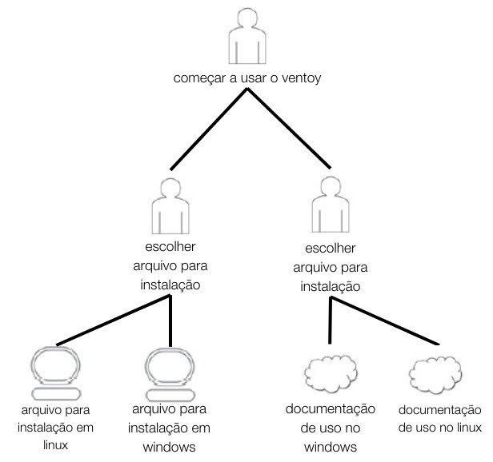

# ConcurTaskTrees (CTT)

## Introdução
O ConcurTaskTrees (CTT), um modelo de árvores que tratam de tarefas concorrentes, foi desenvolvido com o propósito de apoiar a avaliação e o design de Interfaces Humano-Computador (IHC) por Paternò em 2000. Dentro desse modelo, identificam-se quatro categorias distintas de tarefas:

- Tarefas do Usuário: Estas tarefas são executadas fora do sistema, e os usuários desempenham um papel central na sua realização.

- Tarefas do Sistema: Neste caso, o sistema executa processamento sem envolver diretamente a interação com o usuário.

- Tarefas Interativas: Aqui, ocorrem interações diretas entre o usuário e o sistema, muitas vezes na forma de diálogos ou trocas de informações.

- Tarefas Abstratas: Essas não constituem tarefas independentes, mas sim representam composições de tarefas que auxiliam na decomposição e entendimento da funcionalidade do sistema.

Essas categorias, como mostrado na figura 1, proporcionam uma estrutura para analisar e compreender as tarefas envolvidas em um sistema de interface usuário-computador, contribuindo para uma avaliação mais abrangente e um design eficiente.

<b>Figura 01</b> - Tarefas

<b>Fonte</b>: Barbosa e Silva. Interação Humano-Computador. 1 ed.  ELSEVIER INC, 2010.  Capítulo 6, p. 203

## ConcurTaskTrees (CTT)
Nesta seção, apresentaremos as análises de tarefas do site Ventoy pelo método CTT, representadas em diagramas.

### Iniciar o uso do Ventoy
O diagrama feito para analisar esta tarefa foi representado em um diagrama na figura 2. Nesta tarefa o usuário tem como objetivo iniciar o uso do Ventoy.

<b>Figura 02</b> - Diagrama CTT - Iniciar o uso do Ventoy

<b>Fonte</b>:  <a href="https://github.com/MilenaBaruc">Milena Baruc.</a>

### Fazer Postagem no Fórum
O diagrama feito para analisar esta tarefa foi representado em um diagrama na figura 3. Nesta tarefa o usuário tem como objetivo criar um novo post no fórum do Ventoy.

<b>Figura 03</b> - Diagrama CTT - Fazer postagem no fórum

<b>Fonte</b>:  <a href="https://github.com/MilenaBaruc">Milena Baruc.</a>

## Bibliografia
>Barbosa e Silva. Interação Humano-Computador. 1 ed.  ELSEVIER INC, 2010.  Capítulo 6, p. 193.

## Referência Bibliográfica
> Barbosa e Silva. Interação Humano-Computador. 1 ed.  ELSEVIER INC, 2010.

## 📑 Histórico de Versões
| **Versão**   |   **Data**   | **Descrição** | **Autor** | **Revisor** |
|--------|---------|-----------|--------|---------|
|`1.0`| 16/10/2023 | Criação da página de análise de tarefas CTT | [Milena Baruc](https://github.com/MilenaBaruc)| [Mayara Alves](https://github.com/Mayara-tech) e [Altino Arthur](https://github.com/altinoarthurmoreira)|
