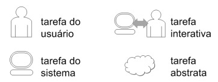

# ConcurTaskTrees (CTT)

## Introdução

O ConcurTaskTrees (CTT), um modelo de árvores que tratam de tarefas concorrentes, foi desenvolvido com o propósito de apoiar a avaliação e o design de Interfaces Humano-Computador (IHC) por Paternò em 2000. Dentro desse modelo, identificam-se quatro categorias distintas de tarefas:

- Tarefas do Usuário: Estas tarefas são executadas fora do sistema, e os usuários desempenham um papel central na sua realização.

- Tarefas do Sistema: Neste caso, o sistema executa processamento sem envolver diretamente a interação com o usuário.

- Tarefas Interativas: Aqui, ocorrem interações diretas entre o usuário e o sistema, muitas vezes na forma de diálogos ou trocas de informações.

- Tarefas Abstratas: Essas não constituem tarefas independentes, mas sim representam composições de tarefas que auxiliam na decomposição e entendimento da funcionalidade do sistema.

Essas categorias, como mostrado na figura 1, proporcionam uma estrutura para analisar e compreender as tarefas envolvidas em um sistema de interface usuário-computador, contribuindo para uma avaliação mais abrangente e um design eficiente.

**Figura 01 -** Tarefas

Fonte: Barbosa e Silva. Interação Humano-Computador. 1 ed.  ELSEVIER INC, 2010.  Capítulo 6, p. 203.¹

## ConcurTaskTrees (CTT)

Nesta seção, apresentaremos as análises de tarefas do site Ventoy pelo método CTT, representadas em diagramas. Todos os CTTs foram feitos tendo como base a [Análise Hierárquica de Tarefas](./analiseHierarquicaDeTarefas.md).

### Iniciar o uso do Ventoy

O diagrama feito para analisar esta tarefa foi representado em um diagrama na figura 2. Nesta tarefa o usuário tem como objetivo iniciar o uso do Ventoy, de acordo como foi visto na [Análise Hierárquica de Tarefas](../analisedetarefas/analiseHierarquicaDeTarefas.md/#iniciar-o-uso-do-ventoy).

**Figura 02 -** Diagrama CTT: Iniciar o uso do Ventoy

Fonte: [Milena Baruc](https://github.com/MilenaBaruc)

### Fazer Postagem no Fórum

O diagrama feito para analisar esta tarefa foi representado em um diagrama na figura 3. Nesta tarefa o usuário tem como objetivo criar um novo post no fórum do Ventoy, de acordo como foi visto na [Análise Hierárquica de Tarefas](../analisedetarefas/analiseHierarquicaDeTarefas.md/#fazer-postagem-no-forum).

**Figura 03 -** Diagrama CTT: Fazer postagem no fórum

Fonte: [Milena Baruc](https://github.com/MilenaBaruc)

### Acessar a página de Doações para realizar uma doação

O diagrama feito para analisar esta tarefa foi representado em um diagrama na figura 4. Nesta tarefa o usuário tem como objetivo fazer uma doação para os desenvolvedores do Ventoy, de acordo como foi visto na [Análise Hierárquica de Tarefas](../analisedetarefas/analiseHierarquicaDeTarefas.md/#acessar-a-pagina-de-doacoes-para-realizar-uma-doacao).

**Figura 04 -** Diagrama CTT - acessar a página de doações para realizar uma doação

Fonte: [Milena Baruc](https://github.com/MilenaBaruc)

### Acessar a página de Testes De Iso

O diagrama feito para analisar esta tarefa foi representado em um diagrama na figura 5. Nesta tarefa o usuário tem como objetivo acessar a página de Testes de Iso do Ventoy, de acordo como foi visto na [Análise Hierárquica de Tarefas](../analisedetarefas/analiseHierarquicaDeTarefas.md/#acessar-a-pagina-de-testes-de-iso).

**Figura 05 -** Diagrama CTT - acessar a página de testes de iso

Fonte: [Milena Baruc](https://github.com/MilenaBaruc)

### Acessar a página de Compartilhamento de Experiências

O diagrama feito para analisar esta tarefa foi representado em um diagrama na figura 6. Nesta tarefa o usuário tem como objetivo acessar a página de compartilhamento de experiências do Ventoy, de acordo como foi visto na [Análise Hierárquica de Tarefas](../analisedetarefas/analiseHierarquicaDeTarefas.md/#acessar-a-pagina-de-compartilhamento-de-experiencias).

**Figura 06 -** Diagrama CTT - acessar a página de compartilhamento de experiências

Fonte: [Milena Baruc](https://github.com/MilenaBaruc)

### Acessar a página de Plugin

O diagrama feito para analisar esta tarefa foi representado em um diagrama na figura 7. Nesta tarefa o usuário tem como objetivo acessar a página de plugin do Ventoy, de acordo como foi visto na [Análise Hierárquica de Tarefas](../analisedetarefas/analiseHierarquicaDeTarefas.md/#acessar-a-pagina-de-plugin).

**Figura 07 -** Diagrama CTT - acessar a página de plugin

Fonte: [Milena Baruc](https://github.com/MilenaBaruc)

## Referência Bibliográfica

**1.** Barbosa e Silva. Interação Humano-Computador. 1 ed.  ELSEVIER INC, 2010.  Capítulo 6, p. 193.

## Bibliografia

> Barbosa e Silva. Interação Humano-Computador. 1 ed.  ELSEVIER INC, 2010.  Capítulo 6.

## 📑 Histórico de Versões

| **Versão**   |   **Data**   | **Descrição** | **Autor** | **Revisor** |
|--------|---------|-----------|--------|---------|
|`1.0`| 16/10/2023 | Criação da página de análise de tarefas CTT | [Milena Baruc](https://github.com/MilenaBaruc) e [Altino Arthur](https://github.com/altinoarthurmoreira)| [Mayara Alves](https://github.com/Mayara-tech)|
|`1.1`| 07/11/2023 | Adição CTTs | [Milena Baruc](https://github.com/MilenaBaruc)| [Mayara Alves](https://github.com/Mayara-tech)|
| `2.0`  | 05/12/2023 | Correção de acordo com as verificações | [Milena Baruc](https://github.com/MilenaBaruc) | [Altino Arthur](https://github.com/altinoarthurmoreira) |
