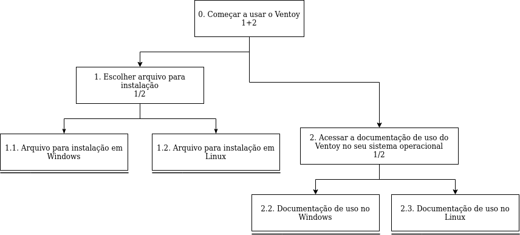
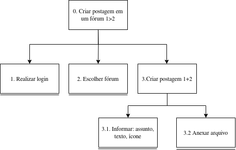

# Análise Hierárquica de Tarefas 
## Introdução 

A Análise Hierárquica de Tarefas (HTA - Hierarchical Task Analysis) é um método de análise de tarefas que é utilizado para obtermos um maior entendimento das competências e de quais tarefas os usuários realizam em um sistema e como eles realizam e o por quê, para nos ajudar a entender o processo da atividade e a identificar os problemas nesse processo.

Nesse método de análise de tarefas, iremos decompor as tarefas em objetivos, objetivo esse que representa o estado final de uma ação. No nível mais alto, os objetivos serão divididos subobjetivos, e a relação entre eles formam um plano, que é a definição de subobjetivos que irão garantir que seja possível atingir um objetivo. 

No nível mais baixo, cada subobjetivo será realizado por uma operação. Logo abaixo na figura 1, há uma demonstração do livro Interação Humano-Computador, de Barbosa e Silva, no capítulo 6, p. 193, que representa os elementos de um diagrama HTA.

Figura 01 - Elementos de um diagrama HTA.

<figure markdown>
  
  <figcaption>Fonte: Barbosa e Silva. Interação Humano-Computador. 1 ed. ELSEVIER INC, 2010. Capítulo 6, p. 193</figcaption>
</figure>

## Análise Hierárquica de Tarefas (HTA)

Nessa seção iremos apresentar as análises de tarefas utilizando o método HTA do site Ventoy, utilizando representações em diagrama e tabela para um maior compreensão.
### Iniciar o uso do Ventoy
O diagrama feito para analisar esta tarefa foi representado em um diagrama na figura 2 e na tabela 1.  Nesta tarefa o usuário tem como objetivo iniciar o uso do Ventoy.

<b>Figura 02</b> - Diagrama HTA do iniciar uso do Ventoy

<b>Fonte</b>:  <a href="https://github.com/yabamiah">Vinicius Mendes.</a>

<b>Tabela 01</b> - Representação HTA em tabela da figura 2

|**Objetivos / Operações** | **Problemas e Recomendações** |
|:------------------------|:---------------------------------|
| 0. Começar a usar o Ventoy 1+2| **Feedback**: Criar um pendrive bootável.   **Plano**: Baixar o Ventoy e acessar a documentação.   **Recomendação**: Interface da documentação mais limpo e minimalista. | 
| 1. Escolher arquivo para instalação 1/2 | **Input**: Clicar em uma das opções de download de arquivos para diferentes sistemas operacionais.   **Plano**: Escolher arquivo compatível com o sistema do usuário. |
| 1.1. Arquivo para instalação em Windows |
| 1.2. Arquivo para instalação em Linux |
| 2. Acessar a documentação de uso do Ventoy no seu sistema operacional 1/2| **Input**: Selecionar tópico de uso do Ventoy na documentação.   **Plano**: Aprender a utilizar o Ventoy no sistema operacional atual do usuário. |
| 2.1. Documentação de uso no Windows |
| 2.2. Documentação de uso no Linux |

### Fazer Postagem no Fórum

O diagrama feito para analisar esta tarefa foi represento em um diagrama na figura 3 e na na tabela 2.
Nesta tarefa o usuário tem como objetivo criar um novo post no fórum do Ventoy.

<b>Figura 03</b> - Diagrama HTA fazer postagem no fórum

<b>Fonte</b>:  <a href="https://github.com/brenob6">Breno</a>

<b>Tabela 02</b> - Representação HTA em tabela da figura 3

|**Objetivos / Operações** | **Problemas e Recomendações** |
|:----------------------|:-------------------------------|
|0. Criar uma postagem em um fórum 1>2|**Plano:** Escrever uma postagem e publicar no fórum.   **Feedback** a nova postagem aparece no fórum com a tag recente.|
|1. Realizar login|**Input** dados de login do usuário.  **feedback** caso não tenha exito no login o usuário deve ser informado.|
|2. Escolher fórum |**Input**: Escolher um fórum que se adaque melhor ao tema da postagem.|
|3. Criar postagem 1+2|**Input**: clica em criar novo post.|
|3.1 Informar: assunto, texto, ícone |**Input**: escrever mensagem da postagem **Recomendação**: salvar rascunho caso o usuário não finalize a ação.|
|3.2 Anexar arquivo|**Input**: anexar algum arquivo ao post  **Recomendação**: permitir ao usuário inserir arquivo arrastando o arquivo.|

## Bibliografia
>Barbosa e Silva. Interação Humano-Computador. 1 ed.  ELSEVIER INC, 2010.  Capítulo 6, p. 193.

## Referência Bibliográfica
> Barbosa e Silva. Interação Humano-Computador. 1 ed.  ELSEVIER INC, 2010.

## 📑 Histórico de Versões
| **Versão**   |   **Data**   | **Descrição** | **Autor** | **Revisor** |
|--------|---------|-----------|--------|---------|
|1.0| 14/10/2023 | Criação da página de analise de tarefas | [Vinícius Mendes](https://github.com/yabamiah) e [Breno](https://github.com/brenob6)| [Breno](https://github.com/brenob6) e [Altino Arthur](https://github.com/arthurrochamoreira)|

