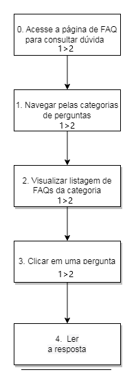
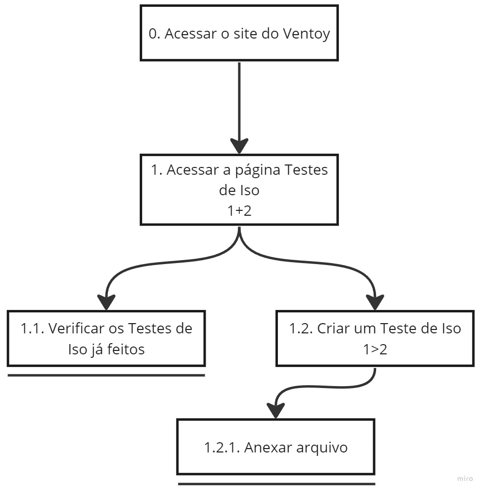
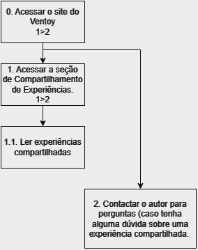

# Análise Hierárquica de Tarefas 

## Introdução 

A Análise Hierárquica de Tarefas (HTA - Hierarchical Task Analysis) é um método de análise de tarefas que é utilizado para obtermos um maior entendimento das competências e de quais tarefas os usuários realizam em um sistema e como eles realizam e o por quê, para nos ajudar a entender o processo da atividade e a identificar os problemas nesse processo.

## Metodologia

Nesse método de análise de tarefas, iremos decompor as tarefas em objetivos, objetivo esse que representa o estado final de uma ação. No nível mais alto, os objetivos serão divididos subobjetivos, e a relação entre eles formam um plano, que é a definição de subobjetivos que irão garantir que seja possível atingir um objetivo. 

No nível mais baixo, cada subobjetivo será realizado por uma operação.E para a criação dos diagramas HTA, iremos utilizar as representações de elementos representados na Figura 1, que foi utilizado de uma demonstração do livro Interação Humano-Computador, de Barbosa e Silva, no capítulo 6, p. 193, que representa os elementos de um diagrama HTA.

**Figura 1** - Elementos de um diagrama HTA

**Fonte**: Barbosa e Silva. Interação Humano-Computador. 1 ed.  ELSEVIER INC, 2010.  Capítulo 6, p. 193

## Análise Hierárquica de Tarefas (HTA)

Nessa seção iremos apresentar as análises de tarefas criados pelos membros, utilizando o método HTA do site Ventoy, utilizando representações em diagrama e tabela para uma maior compreensão.

### Iniciar o uso do Ventoy

O diagrama feito para analisar esta tarefa foi representado em um diagrama na Figura 2 e na Tabela 1.  Nesta tarefa o usuário tem como objetivo iniciar o uso do Ventoy.

**Figura 2** - Diagrama HTA do iniciar uso do Ventoy

**Fonte**: [Vinícius Mendes](https://github.com/yabamiah), 2023.

**Tabela 1** - Representação HTA em tabela da Figura 2

|**Objetivos / Operações** | **Problemas e Recomendações** |
|:------------------------|:---------------------------------|
| 0. Começar a usar o Ventoy 1+2| **Feedback**: Criar um pendrive bootável.   **Plano**: Baixar o Ventoy e acessar a documentação.   **Recomendação**: Interface da documentação mais limpo e minimalista. | 
| 1. Escolher arquivo para instalação 1/2 | **Input**: Clicar em uma das opções de download de arquivos para diferentes sistemas operacionais.   **Plano**: Escolher arquivo compatível com o sistema do usuário. |
| 1.1. Arquivo para instalação em Windows |
| 1.2. Arquivo para instalação em Linux |
| 2. Acessar a documentação de uso do Ventoy no seu sistema operacional 1/2| **Input**: Selecionar tópico de uso do Ventoy na documentação.   **Plano**: Aprender a utilizar o Ventoy no sistema operacional atual do usuário. |
| 2.1. Documentação de uso no Windows |
| 2.2. Documentação de uso no Linux |

**Fonte**: [Vinícius Mendes](https://github.com/yabamiah), 2023.

### Fazer Postagem no Fórum

O diagrama feito para analisar esta tarefa foi represento em um diagrama na Figura 3 e na na Tabela 2.
Nesta tarefa o usuário tem como objetivo criar um novo post no fórum do Ventoy.

  
**Figura 3** - Diagrama HTA fazer postagem no fórum

**Fonte**: [Breno Queiroz](https://github.com/brenob6"), 2023.

**Tabela 2** - Representação HTA em tabela da Figura 3

|**Objetivos / Operações** | **Problemas e Recomendações** |
|:----------------------|:-------------------------------|
|0. Criar uma postagem em um fórum 1>2|**Plano:** Escrever uma postagem e publicar no fórum.   **Feedback** a nova postagem aparece no fórum com a tag recente.|
|1. Realizar login|**Input** dados de login do usuário.  **feedback** caso não tenha exito no login o usuário deve ser informado.|
|2. Escolher fórum |**Input**: Escolher um fórum que se adaque melhor ao tema da postagem.|
|3. Criar postagem 1+2|**Input**: clica em criar novo post.|
|3.1 Informar: assunto, texto, ícone |**Input**: escrever mensagem da postagem **Recomendação**: salvar rascunho caso o usuário não finalize a ação.|
|3.2 Anexar arquivo|**Input**: anexar algum arquivo ao post  **Recomendação**: permitir ao usuário inserir arquivo arrastando o arquivo.|

**Fonte**: [Breno Queiroz](https://github.com/brenob6"), 2023.

### Acessar a página de FAQ para consultar dúvida

O diagrama feito para analisar esta tarefa foi representado em um diagrama na figura 4 e na na tabela 3.
Nesta tarefa o usuário tem como objetivo procurar uma dúvida da instalação na página de FAQ (perguntas frequentes) Ventoy.

<b>Figura 4</b> - Diagrama HTA procurar dúvida na página de FAQ

**Fonte**: [Mayara Alves](https://github.com/Mayara-tech), 2023.

**Tabela 3** - Representação HTA em tabela da Figura 4

|**Objetivos / Operações** | **Problemas e Recomendações** |
|:----------------------|:-------------------------------|
|0. Acessar a página de FAQ para consultar dúvida|**Plano:** Acessar a página de FAQ no site Ventoy.  **Feedback:** Garantir que os usuários encontrem facilmente o link para o FAQ.|
|1. Navegar pelas categorias de perguntas|**Input:** Clicar na categoria de dúvidas relacionada a dúvida.  **Feedback:** Disponibilizar categorias claras e organizadas. **Recomendação:** Inserir consulta de dúvida (Digitar a dúvida ou termos relacionados é realizar busca).
|2. Visualizar listagem de FAQs da categoria|**Feedback:** Apresentar uma lista de FAQs relacionados à categoria selecionada.|
|3. Clicar em uma pergunta|**Input:** Clicar em uma pergunta para expandir a resposta. **Feedback:** Tornar a expansão e contração de respostas intuitivas.|
|4.  Ler a resposta|**Feedback:** Garantir uma exibição clara e legível das respostas. **Recomendação:** Padronizar fonte, tamanho e cor do texto |

**Fonte**: [Mayara Alves](https://github.com/Mayara-tech), 2023.

### Acessar a página de Doações para realizar uma doação

O diagrama feito para analisar esta tarefa foi representado em um diagrama na Figura 5 e na Tabela 4.
Na execução dessa tarefa, o usuário busca contribuir com o projeto Ventoy e apoiar os desenvolvedores por meio de uma doação.

  
**Figura 5** - Diagrama HTA realizar doação na página de doações 

**Fonte**: [Limírio Guimarães](https://github.com/LimirioGuimaraes), 2023.

**Tabela 4** - Representação HTA em tabela da Figura 5

|**Objetivos / Operações** | **Problemas e Recomendações** |
|:----------------------|:-------------------------------|
|0. Acessar o site do ventoy|**Plano:** Acessar a página inicial do ventoy.  **Feedback:** Garantir que os usuários encontrem a página do ventoy na web.|
|1. Acessar a página de doações |**Plano:** Acessar a página de doações no site do ventoy.  **Feedback:** Garantir que os usuários encontrem facilmente o link para a aba de doações.  |
|1.1. Doar utilizando Paypal|**Input:** Clicar no link de doação por paypal. **Feedback:** Redirecionar o usuário para o site do paypal, na aba de doação para o projeto. **Recomendação:** Gerar QrCode para o usuário acessar o link por ele.|
|1.2. Doar utilizando LiberaPay|**Input:** Clicar no link de doação por liberaPay.. **Feedback:** Redirecionar o usuário para o site do liberapay, na aba de doação para o projeto. **Recomendação:** Gerar QrCode para o usuário acessar o link por ele.|
|1.3. Doar Bitcoin|**Output:** Gerar endereço de bitcoin, que permita o usuário copiar para realizar a doação. **Recomendação:** Gerar QrCode para o usuário copiar o endereço por ele.|

**Fonte**: [Limírio Guimarães](https://github.com/LimirioGuimaraes), 2023.

### Acessar a página de Testes De Iso 

O diagrama feito para analisar esta tarefa foi representado em um diagrama na Figura 6 e na Tabela 5.
Na execução dessa tarefa, o usuário busca contribuir ou se aproveitar com o projeto Ventoy e apoiar os desenvolvedores por meio de um Teste de Iso.

  
**Figura 6** - Diagrama HTA realizar Testes de Iso na página Testes de ISO

**Fonte**: [Luis Miranda](https://github.com/LuisMiranda10), 2023.

**Tabela 5** - Representação HTA em tabela da Figura 5

|**Objetivos / Operações** | **Problemas e Recomendações** |
|:----------------------|:-------------------------------|
|0. Acessar o site do ventoy|**Plano:** Acessar a página inicial do ventoy.  **Feedback:** Garantir que os usuários acessem a página do ventoy na web.|
|1. Acessar a página de Testes de Iso |**Plano:** Acessar a página de Testes de Iso no site do ventoy.  **Feedback:** Garantir que os usuários encontrem facilmente o link para a aba de Testes de Iso.  |
|1.1. Verificar os Testes de Iso já feitos|**Input:** Visualizar listagem de Testes de Iso da categoria. **Feedback:** Apresentar uma lista de Testes de Iso relacionados à categoria procurada  **Recomendação:** Inserir consulta para melhor localização da distribuição desejada .|
|1.2. Criar um Teste de Iso|**Input:** Clicar em criar Teste de Iso   |
|1.2.1. Anexar arquivo|**Input**: Solicitar o pull request de Teste de Iso   **Recomendação**: Permitir ao usuário inserir por si próprio na lista de testes de iso.  | 

**Fonte**: [Luis Miranda](https://github.com/LuisMiranda10), 2023.

### Acessar a página de Compartilhamento de Experiências 

O diagrama feito para analisar esta tarefa foi representado em um diagrama na Figura 7 e na Tabela 6. Na execução dessa tarefa, o usuário busca acessar o site do Ventoy e explorar experiências. Ele tem a opção de ler experiências compartilhadas e entrar em contato com o autor da experiência para fazer perguntas. Essa interação ajuda a comunidade do Ventoy a trocar informações e insights úteis sobre o projeto.

**Figura 7** - Diagrama HTA acessar a página de Compartilhamento de Experiências 

**Fonte**: [Altino Arthur](https://github.com/arthurrochamoreira), 2023.

**Tabela 6** - Representação HTA em tabela da Figura 7

|**Objetivos / Operações** | **Problemas e Recomendações** |
|:----------------------|:-------------------------------|
|0. Acessar o site do ventoy|**Plano:** Acessar a página inicial do ventoy.  **Feedback:** Garantir que os usuários acessem a página do ventoy na web.|
|1. Acessar a seção de Compartilhamento de Experiências|**Plano:** Acessar a seção de Compartilhamento de Experiências após entrar no site do ventoy.  **Feedback:** Garantir que os usuários encontrem facilmente a seção de compartilhamento.|
|1.1. Ler experiências compartilhadas|**Input:** Visualizar as experiências compartilhadas por outros usuários.  **Feedback:** Oferecer uma interface amigável para a leitura das experiências.|
|2. Contactar o autor para perguntas|**Input:** Utilizar um meio de contato para fazer perguntas ao autor da experiência.  **Feedback:** Garantir uma comunicação eficiente entre os usuários e os autores das experiências.|

**Fonte**: [Altino Arthur](https://github.com/arthurrochamoreira), 2023.

### Acessar a página de Plugin

O diagrama feito para analisar esta tarefa foi representado em um diagrama na Figura 8 e na Tabela 7. Na execução dessa tarefa, o usuário busca acessar a página de plugin do ventoy. Ele tem a opção de visualizar a documentação para personalizar e aprimorar o Ventoy, por meio de um plugin.

**Figura 8** - Diagrama HTA acessar a página de Plugin 

**Fonte**: [Milena Baruc](https://github.com/MilenaBaruc), 2023.

**Tabela 7** - Representação HTA em tabela da Figura 8

|**Objetivos / Operações** | **Problemas e Recomendações** |
|:----------------------|:-------------------------------|
|0. Acessar o site do ventoy|**Plano:** Acessar a página inicial do ventoy.  **Feedback:** Garantir que os usuários acessem a página do ventoy na web.|
|1. Acessar a página de plugin|**Plano:** Acessar a página de plugin após entrar no site do ventoy.  **Feedback:** Garantir que os usuários encontrem facilmente a página de plugin.|
|2. Ler a documentação sobre plugin|**Input:** Ler a documentação sobre plugin compartilhada pelos desenvolvedores.  **Feedback:** Oferecer uma interface amigável para a leitura da documentação.|
|3. Acessar a documentação sobre plugin|**Input:** Acessar a documentação sobre plugin por meio de um link fornecido.  **Feedback:** Garantir que o link fornecido está correto e esteja com seus dados atualizados.|

**Fonte**: [Milena Baruc](https://github.com/MilenaBaruc), 2023.

## Bibliografia
>Barbosa e Silva. Interação Humano-Computador. 1 ed.  ELSEVIER INC, 2010.  Capítulo 6, p. 193.

## Referência Bibliográfica
> Barbosa e Silva. Interação Humano-Computador. 1 ed.  ELSEVIER INC, 2010.

## 📑 Histórico de Versões
| **Versão**   |   **Data**   | **Descrição** | **Autor** | **Revisor** |
|--------------|--------------|---------------|-----------|-------------|
|`1.0`| 14/10/2023 | Criação da página de analise de tarefas | [Vinícius Mendes](https://github.com/yabamiah), [Breno](https://github.com/brenob6) e [Mayara Alves ](https://github.com/Mayara-tech)| [Altino Arthur](https://github.com/arthurrochamoreira)|
|`2.0`| 20/10/2023 | Adicionado diagrama HTA da tarefa doação | [Limirio Guimarães](https://github.com/LimirioGuimaraes)| [Luis Miranda](https://github.com/LuisMiranda10) |
|`2.1`| 20/10/2023 | Adicionado representação HTA em tabela da figura 5 | [Limirio Guimarães](https://github.com/LimirioGuimaraes)| [Luis Miranda](https://github.com/LuisMiranda10) |
|`2.2`| 23/10/2023 | Adicionado representação HTA da tarefa Compartilhamento de Experiências | [Altino Arthur](https://github.com/arthurrochamoreira)| [Milena Baruc](https://github.com/MilenaBaruc) |
|`2.3`| 07/11/2023 | Adicionado representação HTA da tarefa Plugin | [Milena Baruc](https://github.com/MilenaBaruc)| [Luis Miranda](https://github.com/LuisMiranda10) |
|`3.0` | 05/12/2023 | Correção final do artefato | [Vinícius Mendes](https://github.com/yabamiah) | [Limirio Guimarães](https://github.com/LimirioGuimaraes) |
