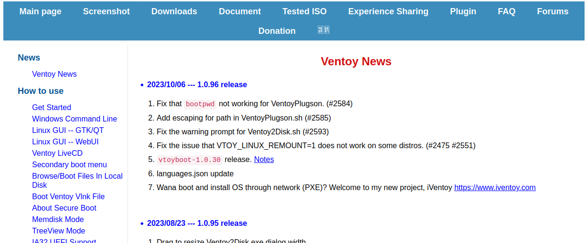
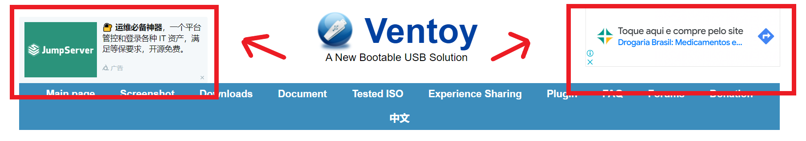
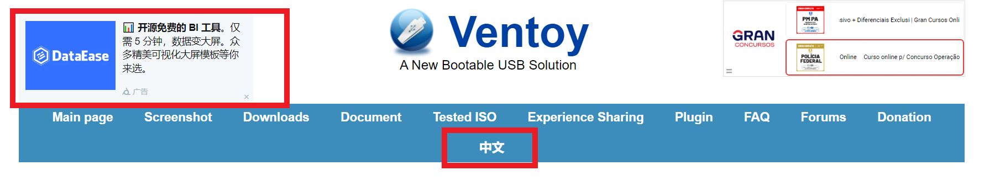
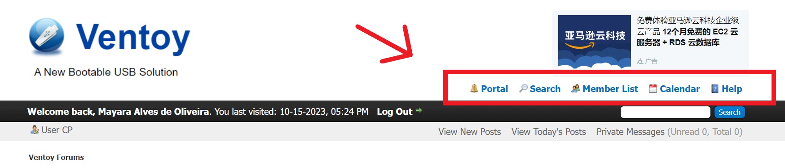
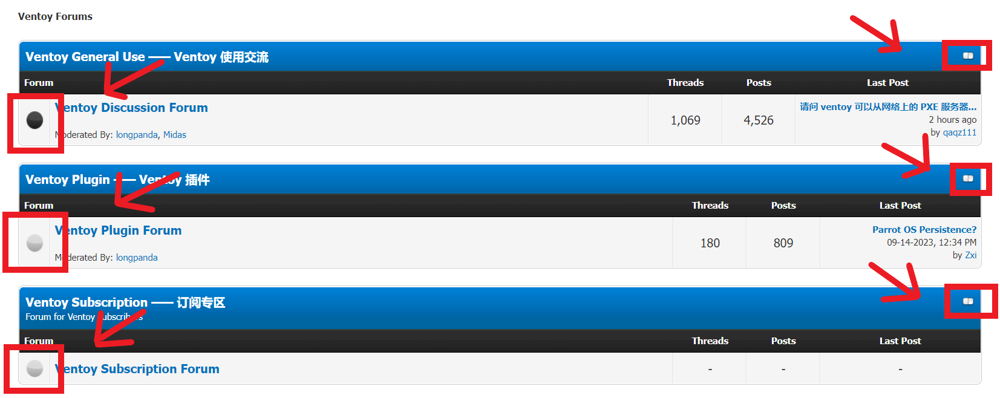

# Metas de Usabilidade

## Introdução

A definição das metas de usabilidade envolve definir os fatores de qualidade de uso que devem ser priorizados no projeto, como serão avaliados ao longo do processo de design, e quais faixas de valores são inaceitáveis, aceitáveis e ideias para cada indicador de interesse ^1^.

Portanto, seriam como o grau em que um produto é usado por usuários específicos para atingir objetivos específicos como eficácia, eficiência e satisfção em um contexto de uso específico. Na análise de requisitos são definidas as metas de usabilidade com base no perfil do usuário e na ánalise de tarefas.

## Metodologia

No âmbito deste projeto, a definição das metas de usabilidade desempenha um papel fundamental na busca pela melhoria da experiência do usuário. Para alcançar esse objetivo, estamos utilizando os critérios estabelecidos Nielsen (1993), que aborda os principais pilares da usabilidade. Estes critérios são eficácia, eficiência, segurança, utilidade, aprendizado e memorização.

Para verificar a eficácia das metas de usabilidade, será conduzida uma simulação do comportamento dos usuários, considerando o perfil de usuário definido, em várias situações de uso identificadas na análise de tarefas. O objetivo é avaliar a implementação de cada meta no sistema, determinando se foram alcançadas, levando em consideração a análise dos criterios mencionados anteriormente.

## Metas

As metas de usabilidade que foram avaliadas no site do Ventoy:

### Eficácia

Um sistema eficaz possui funcionalidades que satisfazem as necessidades principais de seus
usuários.

O site do ventoy possui as seguinte funcionalidade principais:

- Download da ferramenta Ventoy.
- Consulta da documentação da ferramenta Ventoy.
- Fórum onde a comunidade que utiliza a ferramenta pode interagir.
- Página de perguntas frequentes(FAQ).
- Página de doações, onde usuário podem dar suporte financeiro para o desenvolvimento do projeto.

Essas funcionalidades serão priorizada durante o desenvolvimento do projeto.

### Eficiência

A eficiência de um sistema, mede o quão rápido o usuário consegue realizar seu objetivos
com o sistema.

Algumas tarefas que podem ser realizadas no site do Ventoy podem ser aprimoradas para serem concluídas
de maneira mais rápida.

- Consulta de documentação: a documentação não possui sistema de pesquisa, logo o usuário deve
percorrer todos os tópicos manualmente até encontrar o tópico desejado. 
Ver figura 1.
- FAQ: de maneira semelhante a página de FAQ também não possui sistema de pesquisa, logo o usuário
deve percorrer todas as perguntas até encontrar uma que se adeque a sua dúvida.
Ver figura 2.

 <b>Figura 1</b>. Documentação 

Fonte: Site Ventoy.

 <b>Figura 2.</b> Página de FAQ

Fonte: Site Ventoy.

 
### Segurança

Um software seguro pressupõe que o usuário não será exposto a nenhuma situação indesejada
ou perigosa.

- O site do Ventoy possui alguns anúncios de carater duvidoso como podemos ver na figura 3.

 <b>Figura 3</b>. Anúncios 

Fonte: Site Ventoy.

### Utilidade

Um software útil dispõe de ferramentas que são essenciais para um determinada tarefa. 

A principal tarefa do site Ventoy é disponibilizar a ferramentas para download.
Entretanto para que o usuário consiga utilizar a ferramenta é necessário que no site haja no site
as seguintes funcionalidade:

- Documentação detalhada sobre a ferrameta.
- Página de FAQ, para dúvidas frequentes dos usuários.
- Por se tratar de uma comunidade open source, um fórum é fundamental para facilitar a interação da
comunidade, tanto para questões de desenvolvimento, como para tirar dúvidas ou realizações de anúncios
sobre a ferramenta.

### Facilidade de aprendizagem

A facildade de aprendizado se refere ao tempo e esforço necessário para que o usuário aprenda a utilizar o sistema com
determinado nível de competência e desempenho ^1^.

A avaliação da facilidade de aprendizado no Ventoy revela que o site apresenta algumas deficiências
em termos de facilidade de aprendizado logo que o site apresenta algumas formatações inadequadas
como na figura 4 onde podemos ver uma não coerência entre a formação do texto e ausencia de espaçamento
adequado. Navegação confusa, ja que algumas páginas não tem botão para retornar ao menu anterior
como demonstrado na figura 5, além de inconsistencia de idiomas, já que em alguns trechos do
site e possível ver a utilização de mais de um idioma sem a explicação dos mesmos, como podemos
observar na figura 6, todos esses aspectos tendem a atrapalhar o desempenho do usuário com o site. 

 <b>Figura 4</b>. Formatação inadequada

<b>Fonte</b>: Ventoy 

 <b>Figura 5</b>. Navegação confusa 

<b>Fonte</b>: site Ventoy 

 <b>Figura 6</b>. Inconsistências de idiomas 

<b>Fonte</b>: site Ventoy 

### Memorização

A memorização diz respeito ao esforço cognitivo do usuário necessário para lembrar como interagir com a interface do sistema interativo ^1^.

A avaliação da memorização no site Ventoy revela uma dualidade de elementos visuais, onde a presença de ícones intuitivos como observado na Figura 7 que facilita significativamente a interação dos usuários, proporcionando uma experiência mais fluente e agradável. Esses ícones, prontamente identificáveis e associados de maneira clara às suas funções, contribuem positivamente para a memorização e a usabilidade global do site.

 <b>Figura 7</b>. Icones intutivos 

<b>Fonte</b>: site Ventoy 

No entanto, também são identificados ícones menos intuitivos como na figura 8 que podem representar desafios na primeira interação do usuário, dada a falta de associação imediata às funções correspondentes. 

 <b>Figura 8</b>. Icones intutivos 

<b>Fonte</b>: Ventoy 

## Conclusão

Em resumo, a avaliação das metas de usabilidade no site do Ventoy revelou tanto pontos positivos
, quanto áreas que precisam de melhorias. Melhorias na segurança, utilidade, facilidade de aprendizado
e memorização podem aprimorar significativamente a experiência do usuário. Portanto, essas metas
que devem ser priorizados e tratados nas próximas etapas, visando oferecer aos usuários uma experiência
mais eficaz, eficiente e segura.

## Referências Bibliograficas

> 1.  BARBOSA, Simone; SILVA, Bruno. **Interação Humano-Computador**, Editora Elsevier, Rio de Janeiro, 2010

## 📑 Histórico de Versões

| Versão | Data       | Descrição   | Autor   | Revisor                                      |
| ------ | ---------- | ----------- | -------| ------------------------------------------|
| `1.0`  | 23/10/2023 | Criação do documento | [Mayara Alves](https://github.com/Mayara-tech) e [Breno Queiroz](https://github.com/brenob6) |  [Milena Baruc](https://github.com/MilenaBaruc)
| `1.1`  | 06/10/2023 | Melhorias no texto | [Breno Queiroz](https://github.com/brenob6) | [Luis Eduardo](https://github.com/LuisMiranda10) |
