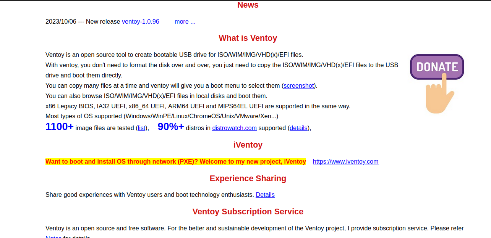
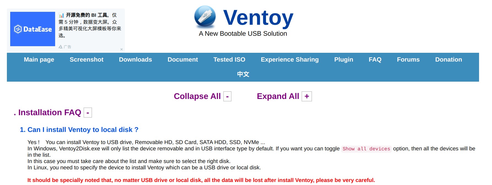

# Princípios Gerais do Projeto

## Introdução

O design de sistemas deve incorporar um modelo conceitual que os usuários possam compreender facilmente. Isso implica em tornar as ações disponíveis, informações visíveis e estabelecer conexões claras entre intenções, ações e resultados. Os princípios gerais comuns em Interação Humano-Computador incluem atender às expectativas dos usuários, manter a simplicidade nas tarefas, equilibrar o controle do usuário, garantir consistência, promover a eficiência, antecipar as necessidades dos usuários, tornar as informações visíveis e reconhecíveis, fornecer conteúdo relevante e projetar interfaces que ajudem na correção de erros. Essas diretrizes são fundamentais para um design de interação e interface eficaz ^1^.

## Breve definição sobre cada princípio

**Correspondência com as expectativas dos usuários**: Certificando-se de que o design da interface corresponda às expectativas dos usuários, garantimos que as ações e os elementos da interface são intuitivos e alinhados com o que os usuários esperam. Isso torna a interação mais fácil e satisfatória para eles. Por exemplo, em um site de comércio eletrônico, atender à expectativa de que os usuários podem navegar e selecionar produtos anonimamente antes de exigir identificação é essencial para corresponder às suas expectativas e oferecer uma experiência positiva.
  
**Simplicidade nas estruturas das tarefas**: Para simplificar as estruturas das tarefas, a recomendação é reduzir a complexidade, tornando o planejamento e a resolução de problemas mais simples. Isso pode ser alcançado de quatro maneiras: mantendo a tarefa igual, mas fornecendo apoio adicional aos usuários; tornando visíveis aspectos que normalmente são invisíveis, melhorando o feedback e o controle do usuário; automatizando total ou parcialmente a tarefa, mantendo sua semelhança original; ou modificando a própria natureza da tarefa. Contudo, é importante evitar a automação excessiva, uma vez que isso pode fazer com que os usuários dependam demais da tecnologia, comprometendo sua capacidade de realizar tarefas sem a ajuda da automação.  
**Equilíbrio entre controle e liberdade do usuário**: Os teóricos destacam a importância de equilibrar o controle e a liberdade do usuário no design de interfaces. Isso implica permitir que o usuário exerça controle sobre a interação, mas com limites para evitar sobrecarga de opções. Oferecer suporte e feedback claro é essencial, bem como possibilitar que o usuário desfaça ações, o que reduz ansiedade e promove aprendizado por exploração.  
**Consistência e padronização**: A consistência e padronização no design de interfaces são fundamentais para facilitar o aprendizado e uso do sistema. Isso envolve assegurar que a interface corresponda ao modelo conceitual do sistema, sendo consistente com as expectativas dos usuários sempre que possível. Quando correspondência direta não é possível, é essencial padronizar ações, resultados de ações, layout de diálogos e visualizações de informações.  
**Promoção da eficiência do usuário**: Promover a eficiência do usuário é fundamental no design de interfaces. Isso significa priorizar a economia de tempo e esforço do usuário em vez de focar na eficiência do computador. Para alcançar isso, sugere-se manter o usuário ocupado, evitando que ele precise esperar o sistema responder para continuar seu trabalho. Processamentos demorados não devem interromper a interação, mas serem executados em segundo plano. Além disso, o sistema deve ser sensível ao que o usuário está fazendo e não interrompê-lo desnecessariamente. Proteger o trabalho dos usuários é essencial, garantindo que eles nunca percam seu trabalho, independentemente da causa da interrupção.   
**Antecipação das necessidades do usuário**: O princípio da antecipação no design de interfaces envolve prever as necessidades e desejos do usuário, em vez de esperar que o usuário busque informações ou acesse ferramentas. O designer deve fornecer informações e ferramentas necessárias em cada etapa do processo. O software deve tomar a iniciativa e fornecer informações adicionais úteis, não apenas responder às perguntas do usuário.   
**Visibilidade e reconhecimento**: O princípio da visibilidade e reconhecimento em design de interfaces enfatiza a importância de tornar as informações e ações visíveis para o usuário. Antes de executar uma ação, a interface deve mostrar claramente o que é possível fazer e como fazer isso. Isso envolve oferecer ações que correspondem às intenções do usuário e evitar mostrar opções que não estão disponíveis ou não fazem sentido naquele momento. O estado do sistema, objetos, ações e opções devem estar atualizados e prontamente perceptíveis para o usuário, sem a necessidade de lembrar informações ou comandos. As instruções de uso do sistema devem ser visíveis e acessíveis quando necessário.  
**Conteúdo relevante e expressão adequada**: O princípio de conteúdo relevante e expressão adequada em design de interfaces destaca a importância de fornecer informações úteis e claras aos usuários. Isso envolve seguir as quatro máximas da conversa cooperativa: qualidade, quantidade, relação (relevância) e modo (clareza). O designer deve fornecer informações verdadeiras, na quantidade necessária, relacionadas ao contexto e apresentadas de forma clara e concisa. Além disso, o design deve ser simples, evitando informações irrelevantes, garantindo a legibilidade do texto e acomodando usuários com deficiências visuais.   
**Projeto para erros**: O princípio de projeto para erros envolve a preparação para o fato de que os usuários podem cometer erros. Os designers devem ajudar os usuários a recuperar-se de erros, fornecendo informações sobre o que aconteceu, as consequências e como reverter resultados indesejados. Isso inclui tornar os sistemas exploráveis, facilitando a reversão de operações e dificultando ações irreversíveis. Evitar a ocorrência de erros é a primeira prioridade, mas, se ocorrerem, o sistema deve detectá-los e oferecer soluções claras e compreensíveis.  

## Metodologia

O grupo realizou uma análise do site do Ventoy. O objetivo da análise foi identificar quais princípios gerais de design o site prioriza e como eles se relacionam com os objetivos do sistema. A análise foi conduzida com base na perspectiva do grupo, levando em conta os aspectos positivos e negativos do site, bem como as sugestões de melhoria que poderiam ser implementadas.

## Análise dos princípios aplicáveis 

### Correspondência com as expectativas do usuário <!-- Limirio -->

Na Figura 1, é possível perceber a violação da Correspondência com a Expectativa do Usuário, dado que a logo do site não é clicável. Geralmente, em muitos sites, os usuários têm a expectativa de que ao clicar na logo do site, eles serão redirecionados para a página inicial. No entanto, neste site, quando se encontra em outra aba ou página, para retornar à página inicial, é necessário procurar na barra de navegação do site, o que pode ser frustrante e confuso para os usuários que estão habituados a essa convenção de usabilidade comum na maioria dos sites. Portanto, essa falta de correspondência com a expectativa do usuário pode resultar em uma experiência menos intuitiva e satisfatória.  

 <b>Figura 1</b>.  Logo do site não é um elemento clicável

<b>Fonte</b>:  <a href="https://github.com/LimirioGuimaraes">Limírio Guimarães</a>

### Promovendo a eficiência do usuário <!-- Limirio -->

Na Figura 2, é possível perceber a violação da promoção da eficiência do usuário, dado que a página onde se encontra o fórum fornece um layout diferente de todas as outras, o que pode confundir o usuário. Além disso, como já citado, a logo não é interativa, tornando impossível ao usuário retornar à página inicial ou a uma página com um layout familiar, a menos que ele utilize recursos do navegador, já que o site não oferece esses recursos. 

Esses problemas podem impactar negativamente a experiência do usuário, dificultando a navegação e a orientação no site. A consistência no design e a presença de elementos interativos, como uma logo que leva de volta à página inicial, são importantes para promover a eficiência e a usabilidade em um site. 

 <b>Figura 2</b>. Página responsável pelo forum não ofere eficiência ao usuário

<b>Fonte</b>:  <a href="https://github.com/LimirioGuimaraes">Limírio Guimarães</a>

### Visibilidade e reconhecimento <!-- Limirio -->

Como já citado a a falta de um menu de navegação claro e consistente em todas as páginas, ferem o pricípio de visibilidade e reconhecimento. Isso pode dificultar a localização e o acesso às informações desejadas pelos usuários. 

No entanto há outros problemas como a ausência de feedback visual ou sonoro para as ações dos usuários. Por exemplo, quando o usuário clica no botão de download, não há nenhuma indicação de que o download está sendo realizado, a não ser que o navegador informe o usuário. Isso pode gerar confusão e frustração nos usuários. 

Outro fator é a utilização de termos técnicos e siglas sem explicação ou definição, como apresentado na figura 3. Por exemplo, o site usa as siglas ISO, WIM, IMG, VHD, EFI, entre outras, sem explicar o que elas significam ou para que servem. Isso pode dificultar a compreensão e o uso do sistema pelos usuários. 

 <b>Figura 3</b>. Termos técnicos e siglas sem explicação ou definição

<b>Fonte</b>:  <a href="https://github.com/LimirioGuimaraes">Limírio Guimarães</a>

### Consistência e padronização <!-- Yaba -->

Como foi citado anteriormente, haver uma consistência e uma boa padronização, facilita o usuário a identificar os padrões de um sistema, ocasionando no rápido aprendizado do uso de um sistema. 

E navegando pelo site do Ventoy, foi possível identificar uma falta segmento acerca deste princípio da Consistência e padronização. As figuras a seguir demonstram falta de padronização em textos destacados, títulos e em elementos de itens, estão presentes nas Figuras 4, 5, 6 e 7. E uma recomendação para essa violação, é simples e de fácil resolução, basta criar um estilo padrão e garantir em que todas as páginas do site estão o seguindo.

 <b>Figura 4</b> - Cores dos textos em destaques, títulos e itens da página inicial.

<b>Fonte</b>:  <a href="https://github.com/yabamiah">Vinícius Mendes Martins</a>

 <b>Figura 5</b> - Cores dos textos em destaques e itens da documentação.

<b>Fonte</b>:  <a href="https://github.com/yabamiah">Vinícius Mendes Martins</a>

 <b>Figura 6</b> - Cores dos textos em destaques e itens da página inicial.

<b>Fonte</b>:  <a href="https://github.com/yabamiah">Vinícius Mendes Martins</a>

 <b>Figura 7</b> - Cor do título da página de Compartilhamento de experiência.

<b>Fonte</b>:  <a href="https://github.com/yabamiah">Vinícius Mendes Martins</a>

### Antecipação <!-- Yaba -->

A antecipação é um dos princípios que de acordo com o [Brainstorming](https://interacao-humano-computador.github.io/2023.2-Ventoy/elicitacao/elicitacao%20de%20requisitos%20/Brainstorming/) feito com os usuários do site, é violado, pois os usuários esperam encontrar o que querem logo na página inicial, que é o Download do software Ventoy, o facilitaria ainda mais o usuário que tem como objetivo acessar o site com o mínimo de tempo possível. Na Figura 8 é possível visualizar que não tem essa informação antecipada. E uma recomendação para essa violação, é colocar uma seção falando sobre download e colocar o link para abaixar logo ali da página inicial também.

 <b>Figura 8</b> - Informações da página inicial.

<b>Fonte</b>:  <a href="https://github.com/yabamiah">Vinícius Mendes Martins</a>

### Conteúdo relevante e expressão adequada <!-- Yaba -->

Este princípio possui extrema importância, uma vez que está diretamente relacionado à experiência do usuário ao utilizar o sistema. O usuário tem a expectativa de que o sistema seja não apenas funcional, mas também agradável, apresentando informações de maneira clara, de fácil leitura e acesso. Analisando as figuras anteriores, como a Figura 8, Figura 3, Figura 5, entre outras, observamos a presença de cores intensas que não contrastam de maneira ideal com o fundo do site, além de uma fonte de tamanho reduzido.

Uma sugestão para abordar essa questão seria adotar uma paleta de cores mais suaves, proporcionando uma experiência visual mais agradável. Além disso, considerar a troca para um modo de fundo escuro pode contribuir significativamente para a legibilidade, especialmente em contraste com a fonte, que também pode ser aumentada para melhorar a experiência de leitura para todos os usuários. Essas medidas não apenas atenderiam às expectativas do usuário quanto à estética e clareza, mas também otimizariam a acessibilidade do sistema.

## Bibliografia

> Barbosa, S. D. J.; Silva, B. S. da; Silveira, M. S.; Gasparini, I.; Darin, T.; Barbosa, G. D. J. (2021) Interação Humano-Computador e Experiência do usuário.  
> BANCO CENTRAL. Interação Humano Computador. Distrito Federal, 2023. Disponível em: <https://github.com/Interacao-Humano-Computador/2023.1-BancoCentral/>. Acesso em: 21/10/2023.

## Referências Bibliográficas

> <a id=“RP1” href=“#TEC1”>1.</a> Barbosa, S. D. J.; Silva, B. S. da; Silveira, M. S.; Gasparini, I.; Darin, T.; Barbosa, G. D. J. (2021) Interação Humano-Computador e Experiência do usuário.

|  Versão  |    Data    | Descrição |  Autor(es) | Revisor(es)|
|--------- | -----------| --------- | ---------- | ---------- |
|  `1.0`   | 20/10/2023 | Introdução, Definição e Metodologia |[Limirio Guimarães](https://github.com/LimirioGuimaraes) | [Mayara Alves](https://github.com/Mayara-tech)  |
|  `1.1`   | 21/10/2023 | Adicionado análise de correspondência com as expectativas do usuário   |[Limirio Guimarães](https://github.com/LimirioGuimaraes) | [Mayara Alves](https://github.com/Mayara-tech) |
|  `1.2`   | 21/10/2023 | Adicionado  análise de eficiência do usuário    |[Limirio Guimarães](https://github.com/LimirioGuimaraes) | [Mayara Alves](https://github.com/Mayara-tech)  |
|  `1.3`   | 21/10/2023 | Adicionado análise de visibilidade e reconhecimento    |[Limirio Guimarães](https://github.com/LimirioGuimaraes) | [Mayara Alves](https://github.com/Mayara-tech)  |
|  `1.4`   | 21/10/2023 | Adicionando análise de consistência e padrão |[Vinícius Mendes](https://github.com/yabamiah) | [Mayara Alves](https://github.com/Mayara-tech)  |
|  `1.5`   | 21/10/2023 | Adicionado análise de antecipação  |[Vinícius Mendes](https://github.com/yabamiah) | [Mayara Alves](https://github.com/Mayara-tech)  |
|  `1.6`   | 21/10/2023 | Adicionado  análise de conteúdo relevante e expressão adequada    |[Vinícius Mendes](https://github.com/yabamiah) | [Mayara Alves](https://github.com/Mayara-tech) |

