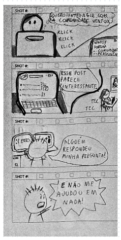
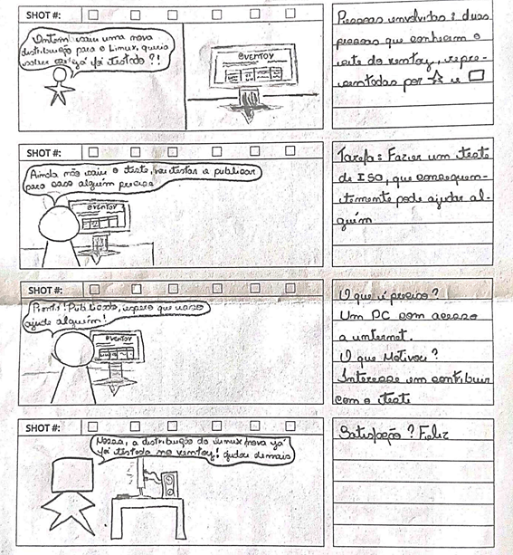
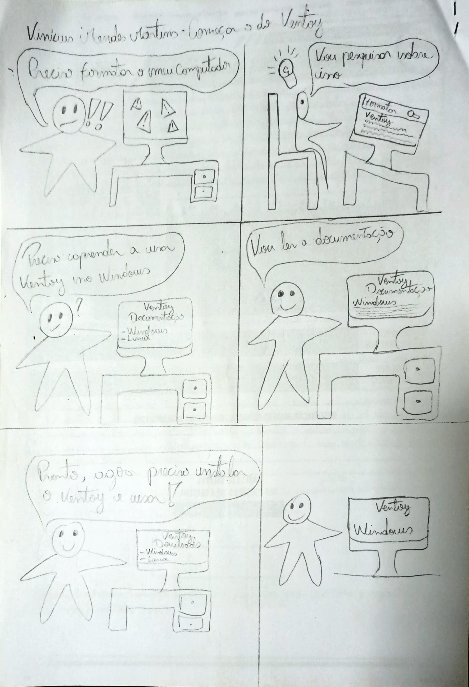

# Storyboard

## Introdução

Storyboard é um protótipo de baixa fidelidade que consiste em uma
série de desenhos organizados de forma sequencial, que representam
etapas ou cenas de interação do usuário com o produto em desenvolvimento.
É uma ferramenta muito útil do processo de design, pois oferece
uma representação visual clara do fluxo de trabalho do usuário.
E auxilia os designers a encontrarem potenciais problemas antes do
início da fase de desenvolvimento.(PREECE)

## Storyboard 1

O storyboard visualizado na figura 1 demonstra o uso do fórum do Ventoy por dois usuários.
Baseado no <a href="../../../../AnaliseDeRequisitos/cenarios/#cenario-02">cenário 2</a>.

**Figura 1**: Storyboard Utilizando o Fórum

{width="50%"}

Fonte: [Breno Queiroz](https://github.com/brenob6)

## Storyboard 2:

O storyboard visualizado na figura 2 demonstra o uso do FAQ de perguntas do Ventoy por um usúario que está passando por dificuldade para formatar seu computador.

**Figura 2**: Storyboard Utilizando o FAQ

Fonte: [Mayara Alves](https://github.com/Mayara-tech)

## Storyboard 3:

O storyboard retratado na figura 3 exibe um usuário navegando pela aba de "Compartilhamento de Experiências" do Ventoy, procurando soluções para desafios enfrentados ao dar boot em seu computador.

**Figura 3**: Storyboard Utilizando o Compartilhamento de Experiências

Fonte: [Altino Arthur](https://github.com/arthurrochamoreira)

## Storyboard 4:

O storyboard retratado na figura 4 ilustra um diálogo entre dois usuários, no qual um deles reconhece que o Ventoy facilitou muito sua busca por uma nova distribuição linux e decide colaborar com o projeto fazendo uma doação. Para isso, ele acessa o site do Ventoy e procura a opção de doar.

**Figura 4**: Storyboard Utilizando o Ventoy

Fonte: [Limírio Guimarães](https://github.com/LimirioGuimaraes)

## Storyboard 5:

O storyboard visualizado na figura 5 demonstra o uso do Testes de Iso  do Ventoy por um usúario que está verificando se uma distribuição já foi testada.

**Figura 5**: Storyboard Utilizando o Testes de Iso

Fonte: [Luis Eduardo](https://github.com/LuisMiranda10)

## Storyboard 6:
O storyboard apresentado na Figura 6, ilustra um cenário onde um jovem usuário de um computador com problemas, necessecita formatar seu computador, e em suas pequisas para procurar algo, ele encontrou o Ventoy, a partir disso, ele leu a sua documentação e o instalou para poder utilizar.

**Figura 6**: 

Fonte: [Vinícius Mendes](https://github.com/yabamiah)

## Storyboard 7:

**Figura 7**: 

Fonte: 

## Bibliografia
> PREECE, Rogers Sharp **Design de Interação - Além da interação homem-computador** Bookman 

## 📑 Histórico de versões:

|Versão |    Data    |     Descrição       |  Autor(es)  |                  Revisor(es)
:-----: | :--------: | :-----------------: | :----------:| :-----------------------------------: 
|`1.0`  | 28/10/2023 | Criação do documento|[Breno Queiroz](https://github.com/brenob6)| 
|`1.1`  | 28/10/2023 |Adicionado Storyboard 1|[Breno Queiroz](https://github.com/brenob6)| 
|`1.1`  | 29/10/2023 |Adicionado Storyboard 2|[Mayara Alves]([https://github.com/](https://github.com/Mayara-tech))|[Mayara Alves]([https://github.com/](https://github.com/Mayara-tech)) 
|`1.1`  | 29/10/2023 |Adicionado Storyboard 3|[Altino Arthur](https://github.com/arthurrochamoreira)| 
|`1.1`  | 29/10/2023 |Adicionado Storyboard 4|[Limírio Guimarães](https://github.com/LimirioGuimaraes)| 
|`1.1`  | 29/10/2023 |Adicionado Storyboard 5|[Luis Eduardo]([https://github.com/](https://github.com/LuisMiranda10))|[Luis Eduardo](https://github.com/LuisMiranda10) 
|`1.1`  | 29/10/2023 |Adicionado Storyboard 6|[Vinícius Mendes]([https://github.com/](https://github.com/yabamiah))|[Vinícius Mendes]([https://github.com/](https://github.com/yabamiah)) 
|`1.1`  | 29/10/2023 |Adicionado Storyboard 7|| 
