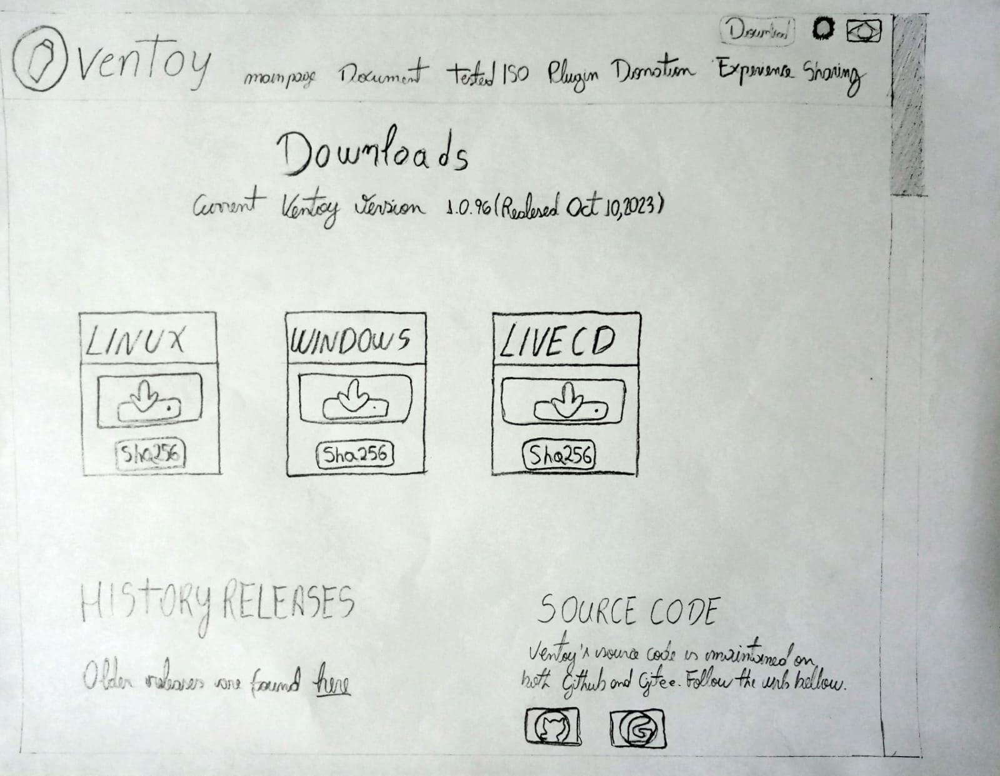
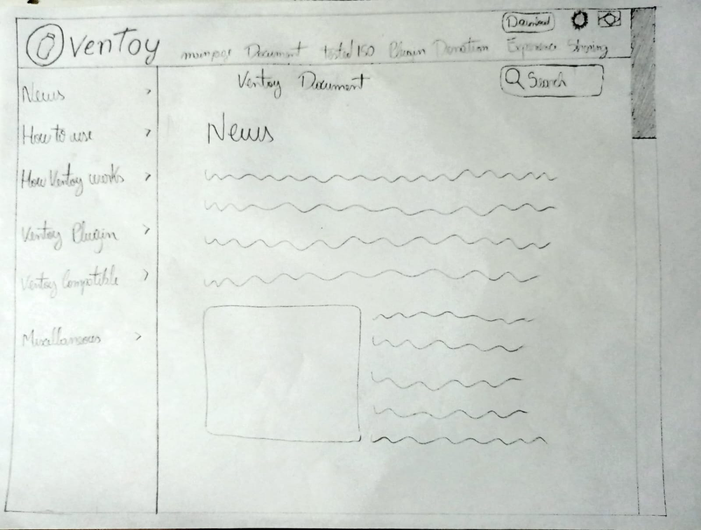
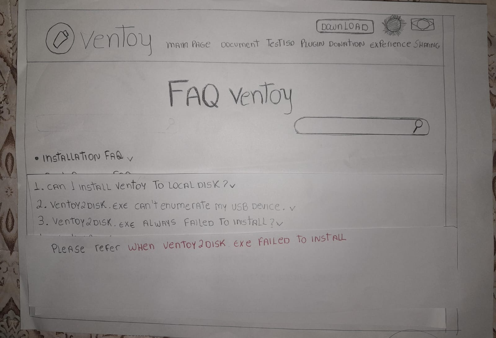

# Protótipos de Papel

## Introdução

Um protótipo é um esboço de produto ou serviço que busca visualizar uma ideia, entender comportamentos ou testar soluções. Ele é resultado de descobertas feitas em fases anteriores, sendo sustentado por hipóteses a serem testadas antes da construção do produto final. No caso do prótotipo de papel é de baixa a média fidelidade. Cada integrante do grupo deve adicionar a esse artefato o seu prótotipo e o teste piloto.

## Metodologia 

A metodologia utilizada para construção do prótotipo de papel são as baseadas nas tarefas ilustrada na [Análise de tarefas](https://interacao-humano-computador.github.io/2023.2-Ventoy/AnaliseDeRequisitos/analisedetarefas/analiseHierarquicaDeTarefas/), com base nestas tarefas foi desenvolvido um design alternativo para cada página, e realizado uma protótipação de papel desse design que em seguida passa por um teste piloto. Na tabela 1 é possível observar o cronograma de execução do protótipo de papel.

<b>Tabela 01</b> - Cronograma executado - Protótipo de papel 

| Descrição | Responsável | Data da elaboração do protótipo | Data do teste piloto
| :---------------------------------------------: | :----------------------: | :----------------------: | :----------------------: 
| Iniciar o uso do Ventoy  | [Vinicius Mendes](https://github.com/yabamiah) | 21/11/2023 | 22/11/2023
| Realizar postagem no fórum | [Breno Queiroz](https://github.com/brenob6) | 19/11/2023 | 20/11/2023
| Acessar a página de FAQ para consultar dúvida | [Mayara Alves](https://github.com/Mayara-tech) | 21/11/2023 | 22/11/2023
| Acessar a página de Doações para realizar uma doação |[Limirio Guimarães](https://github.com/LimirioGuimaraes) | 22/11/2023| - 
| Acessar a página de Testes de ISO para verificar os testes| [Luis Miranda](https://github.com/LuisMiranda10) | 21/11/2023 | 22/11/2023
| Acesso à página de Compartilhamento de Experiências| [Altino Arthur](https://github.com/arthurrochamoreira) | 22/11/2023 | -
| Acesso à página de plugin  | [Milena Baruc](https://github.com/MilenaBaruc)| 21/11/2023 |22/11/2023

Fonte: [Mayara Alves](https://github.com/Mayara-tech).

## Protótipo 1 - Iniciar o uso do Ventoy

O protótipo de papel apresentado na Figura 1 e 2, ilustram páginas do site do Ventoy, sendo respectivamente a página de [Downloads](https://www.ventoy.net/en/download.html) e de [Document](https://www.ventoy.net/en/doc_news.html).

  
  **Figura 1** - Acesso a página de Downloads

  

  Fonte: [Vinícius Mendes](https://github.com/yabamiah)

  **Figura 2** - Acesso a página de Documento

  

  Fonte: [Vinícius Mendes](https://github.com/yabamiah)
  

### Teste Piloto

A partir disso, foi feito um testo piloto para verificar o funcionamento do processo, antes de irmos para a entrevista e relato sobre o protótipo descrito. Além disso, o teste piloto permite testar os instrumentos, garantir que cada um renderá resultados próprios para responder as perguntas de pesquisa; antever resultados; avaliar a viabilidade e utilidade dos métodos de coleta em cada fase de execução; revisar e aprimorar os pontos necessários. Para acessa-lá basta [clicar aqui](https://youtu.be/QaR2__Q8lYw), foi gravada em 22/11 às 8:14. Foi feita de acordo com o [planejamento do relato](./planejamento_relato.md/#preparo) feito pelo grupo.

## Protótipo 2 - Postagem no fórum Ventoy

O protótipo de papel apresentado na figura 3, ilustra as páginas que serão acessadas para realizar uma postagem no fórum Ventoy.

**Figura 3**: Realizar postagem no fórum

Fonte: [Breno Queiroz](https://github.com/brenob6)

### Teste-Piloto

A partir disso, foi feito um testo piloto para verificar o funcionamento do processo, antes de irmos para a entrevista e relato sobre o protótipo descrito. Além disso, o teste piloto permite testar os instrumentos, garantir que cada um renderá resultados próprios para responder as perguntas de pesquisa; antever resultados; avaliar a viabilidade e utilidade dos métodos de coleta em cada fase de execução; revisar e aprimorar os pontos necessários. Para acessa-lá basta [clicar aqui](https://youtu.be/bfJcuGFK1ko), foi gravada em 20/11 às 20:00. Foi feita de acordo com o [planejamento do relato](./planejamento_relato.md/#preparo) feito pelo grupo.

## Protótipo 3 - Acessar a página de FAQ para consultar dúvida

O protótipo de papel apresentado na figura 4, ilustra uma das páginas do site do ventoy, referente a página de [FAQ](https://www.ventoy.net/en/faq.html)

**Figura 4**: Acessar a página de FAQ para consultar dúvida

Fonte: [Mayara Alves](https://github.com/Mayara-tech)

### Teste Piloto

A partir disso, foi feito um testo piloto para verificar o funcionamento do processo, antes de irmos para a entrevista e relato sobre o protótipo descrito. Além disso, o teste piloto permite testar os instrumentos, garantir que cada um renderá resultados próprios para responder as perguntas de pesquisa; antever resultados; avaliar a viabilidade e utilidade dos métodos de coleta em cada fase de execução; revisar e aprimorar os pontos necessários. Para acessa-lá basta [clicar aqui](https://youtube.com/shorts/_lG3-rFcJ08), foi gravada em 22/11 às 08:42. Foi feita de acordo com o [planejamento do relato](./planejamento_relato.md/#preparo) feito pelo grupo.

## Protótipo 4 - Acessar a página de Doações para realizar uma doação

O protótipo de papel apresentado na figura 5, ilustra uma das páginas do site do ventoy, referente a página de [doação](https://www.ventoy.net/en/donation.html)

**Figura 5**: Acessar a página de Doações para realizar uma doação

Fonte: [Limirio Guimarães](https://github.com/LimirioGuimaraes)

## Protótipo 5 - Acessar a página de Testes de ISO para verificar os testes

O prótotipo de papel apresentado na figura 6, ilustra uma das páginas do site Ventoy, referente a página de [testes de ISO](https://www.ventoy.net/en/isolist.html).

**Figura 6**: Acesso a página de Testes de ISO

Fonte: [Luis Miranda](https://github.com/LuisMiranda10)

### Teste Piloto

A partir disso, foi feito um testo piloto para verificar o funcionamento do processo, antes de irmos para a entrevista e relato sobre o protótipo descrito. Para acessa-lá basta [clicar aqui](https://youtu.be/pKw4u7akbbI), foi gravada em 22/11 às 13:00. Foi feita de acordo com o [planejamento do relato](./planejamento_relato.md/#preparo) feito pelo grupo.

## Protótipo 6 - Acesso à página de Compartilhamento de Experiências

O prótotipo de papel apresentado na figura 7, ilustra uma das páginas do site Ventoy, referente a aba [Experience Sharing](https://www.ventoy.net/en/experience.html).

**Figura 7**: Acesso à página de Compartilhamento de Experiências

Fonte: [Altino Arthur](https://github.com/arthurrochamoreira).

## Protótipo 7 - Acesso à página de plugin

O prótotipo de papel apresentado na figura 8, ilustra uma das páginas do site Ventoy, referente a aba [plugin](https://www.ventoy.net/en/plugin.html).

**Figura 8**: Acesso à página de plugin

Fonte: [Milena Baruc](https://github.com/MilenaBaruc).

### Teste Piloto

A partir disso, foi feito um testo piloto para verificar o funcionamento do processo, antes de irmos para a entrevista e relato sobre o protótipo descrito. Além disso, o teste piloto permite testar os instrumentos, garantir que cada um renderá resultados próprios para responder as perguntas de pesquisa; antever resultados; avaliar a viabilidade e utilidade dos métodos de coleta em cada fase de execução; revisar e aprimorar os pontos necessários. Para acessa-lá basta [clicar aqui](https://youtu.be/rH3lhLAYO7I), foi gravada em 22/11 às 10:00. Foi feita de acordo com o [planejamento do relato](./planejamento_relato.md/#preparo) feito pelo grupo.

## Bibliografia

> PREECE, Rogers Sharp **Design de Interação - Além da interação homem-computador** Bookman  

## 📑 Histórico de Versões 

| **Versão**   |   **Data**   | **Descrição** | **Autor** | **Revisor** |
|--------|---------|-----------|--------|---------|
|`1.0`| 22/11/2023 | Criação do documento | [Milena Baruc](https://github.com/MilenaBaruc) | [Mayara Alves](https://github.com/Mayara-tech) |
|`1.1`| 22/11/2023 | Adicionando protótipo 7 | [Milena Baruc](https://github.com/MilenaBaruc) | [Mayara Alves](https://github.com/Mayara-tech) |
|`1.2`| 22/11/2023 | Adicionando protótipo 5 | [Luis Miranda](https://github.com/LuisMiranda10) | [Vinicius Mendes](https://github.com/yabamiah)  |
|`1.3`| 22/11/2023 | Adicionando protótipo 3 | [Mayara Alves](https://github.com/Mayara-tech) | [Vinicius Mendes](https://github.com/yabamiah)  |
|`1.4`| 22/11/2023 | Adicionando protótipo 4 | [Limirio Guimarães](https://github.com/LimirioGuimaraes) |  [Luis Miranda](https://github.com/LuisMiranda10)  |
|`1.5`| 22/11/2023 | Adicionando protótipo 2 | [Breno Queiroz](https://github.com/brenob6)      | [Mayara Alves](https://github.com/Mayara-tech)   |
|`1.6`| 22/11/2023 | Adicionando protótipo 6 | [Altino Arthur](https://github.com/arthurrochamoreira) | [Vinicius Mendes](https://github.com/yabamiah)  |
|`1.7`| 05/12/2023 | Adicionando metodologia | [Mayara Alves](https://github.com/Mayara-tech)| [Breno Queiroz](https://github.com/brenob6)  |
| `2.0`  | 05/12/2023 | Correção de acordo com as verificações | [Milena Baruc](https://github.com/MilenaBaruc) |[Altino Arthur](https://github.com/arthurrochamoreira) |
