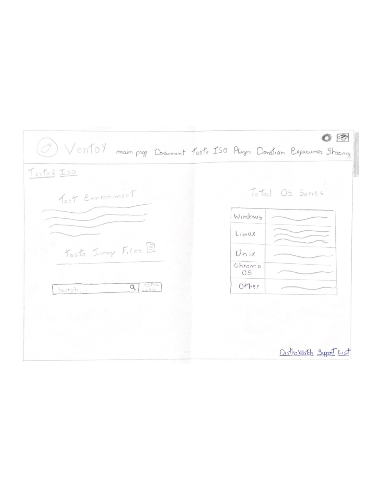
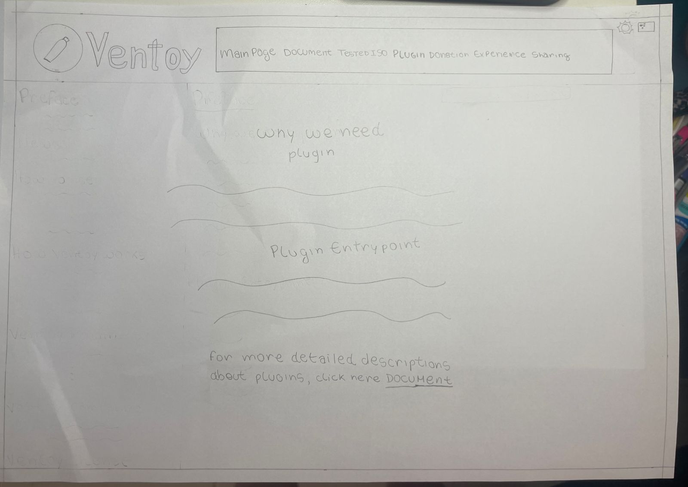

# Protótipos de Papel

## Introdução

Um protótipo é um esboço de produto ou serviço que busca visualizar uma ideia, entender comportamentos ou testar soluções. Ele é resultado de descobertas feitas em fases anteriores, sendo sustentado por hipóteses a serem testadas antes da construção do produto final. No caso do prótotipo de papel é de baixa a média fidelidade.

## Protótipo 1 - 

## Protótipo 2 - 

## Protótipo 3 - 

## Protótipo 4 - 

## Protótipo 5 - Acessar a página de Testes de ISO para verificar os testes
O prótotipo de papel apresentado na figura 5, ilustra uma das páginas do site Ventoy, referente a página de [testes de ISO](https://www.ventoy.net/en/isolist.html).

**Figura 5**: Acesso a página de Testes de ISO

Fonte: [Luis Miranda](https://github.com/LuisMiranda10)

## Protótipo 6 - 

## Protótipo 7 - Acesso à página de plugin

O prótotipo de papel apresentado na figura 7, ilustra uma das páginas do site Ventoy, referente a aba [plugin](https://www.ventoy.net/en/plugin.html).

**Figura 7**: Acesso à página de plugin

Fonte: [Milena Baruc](https://github.com/MilenaBaruc).

### Teste Piloto

A partir disso, foi feito um testo piloto para verificar o funcionamento do processo, antes de irmos para a entrevista e relato sobre o protótipo descrito. Além disso, o teste piloto permite testar os instrumentos, garantir que cada um renderá resultados próprios para responder as perguntas de pesquisa; antever resultados; avaliar a viabilidade e utilidade dos métodos de coleta em cada fase de execução; revisar e aprimorar os pontos necessários. Para acessa-lá basta [clicar aqui](https://youtu.be/rH3lhLAYO7I), foi gravada em 22/11 às 10:00. Foi feita de acordo com o [planejamento do relato](../prototipoDePapel/plan_relato.md/#preparo) feito pelo grupo.

## Bibliografia

> PREECE, Rogers Sharp **Design de Interação - Além da interação homem-computador** Bookman  

## 📑 Histórico de Versões

| **Versão**   |   **Data**   | **Descrição** | **Autor** | **Revisor** |
|--------|---------|-----------|--------|---------|
|`1.0`| 22/11/2023 | Criação do documento | [Milena Baruc](https://github.com/MilenaBaruc) | [Mayara Alves](https://github.com/Mayara-tech) |
|`1.1`| 22/11/2023 | Adicionando protótipo 5 | [Luis Miranda](https://github.com/LuisMiranda10) | [Vinicius Mendes](https://github.com/yabamiah)  |
