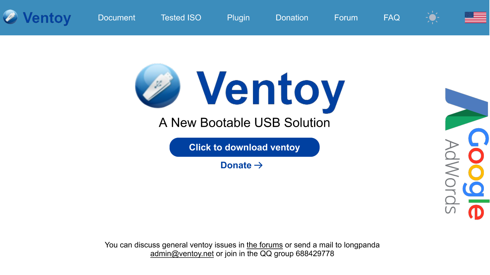
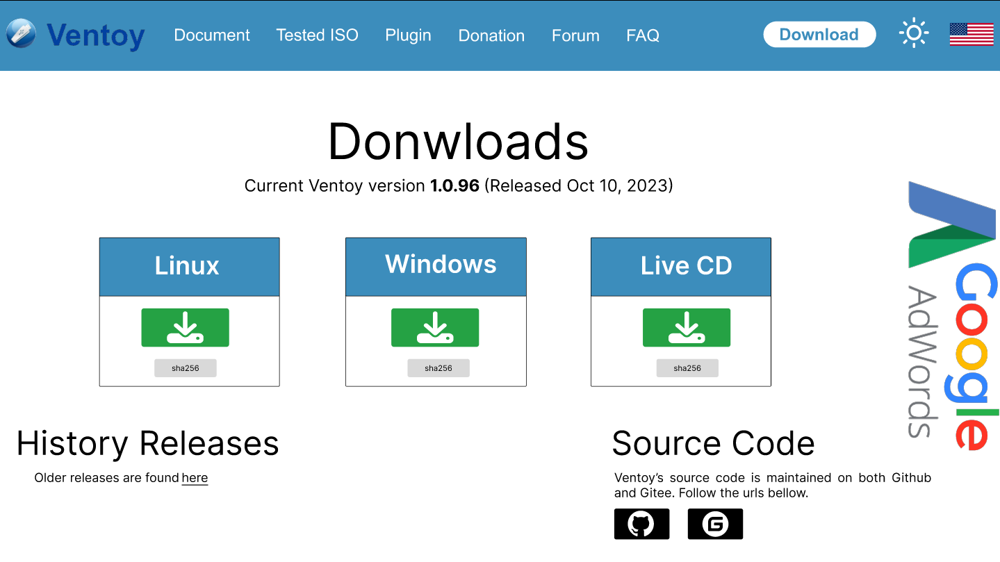
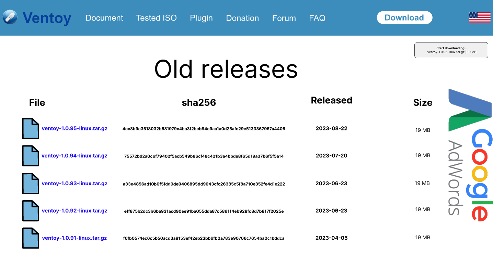

# Protótipos de alta fidelidade 

## Introdução

É com grande entusiasmo que apresentamos este projeto acadêmico, uma imersão inovadora na otimização da experiência do usuário por meio da evolução visual e funcional do Ventoy. Este trabalho representa um esforço colaborativo e dedicado, destacando os protótipos de alta fidelidade gerados no Figma^1^, uma ferramenta de design digital que permite não apenas visualizar, mas também interagir com as nuances de cada elemento.

## Metodologia

A metodologia utilizada para construção do prótotipo de papel são as baseadas nas tarefas ilustrada na [Análise de tarefas](https://interacao-humano-computador.github.io/2023.2-Ventoy/AnaliseDeRequisitos/analisedetarefas/analiseHierarquicaDeTarefas/#fazer-postagem-no-forum) e nos resultados do [prótipo de baixa fidelidade](https://interacao-humano-computador.github.io/2023.2-Ventoy/DAD/nivel2/prototipoDePapel/Prototipos/), com base nestas tarefas foi desenvolvido um design alternativo para algumas páginas. 

### Página inicial
A figura 1 apresenta o protótipo de alta fidelidade da página inicial.

**Figura 01**: Protótipo de alta fidelidade da página inicial;

Fonte: [Limírio Guimarães](https://github.com/LimirioGuimaraes)

### Download
As figura 2, 3 e 4 apresentam o protótipo de alta fidelidade do download.

**Figura 02**: Protótipo de alta fidelidade da página de download;

Fonte: [Limírio Guimarães](https://github.com/LimirioGuimaraes)

**Figura 03**: Protótipo de alta fidelidade da página de download/linux;

Fonte: [Limírio Guimarães](https://github.com/LimirioGuimaraes)

**Figura 04**: Protótipo de alta fidelidade da página de downloado/linux após clicar no download de uma versão;

Fonte: [Limírio Guimarães](https://github.com/LimirioGuimaraes)

## Referência Bibliográficas

> 1. FIGMA. Disponível em: [Figma](https://www.figma.com/). Acesso em: 22 de Nov. 2023. 

## Bibliografia

> PREECE, Rogers Sharp Design de Interação - Além da interação homem-computador Bookman

## 📑 Histórico de Versões

| Versão  |    Data    |                        Descrição                        |                                             Autor(es)                                             |                  Revisor(es)                   |
| :-----: | :--------: | :-----------------------------------------------------: | :-----------------------------------------------------------------------------------------------: | :--------------------------------------------: |
|`1.0` | 06/12/2023 | Criação da página de protótipos de alta fidelidase.                       | [Limírio Guimarães](https://github.com/LimirioGuimaraes) | [Mayara Alves](https://github.com/Mayara-tech)|
