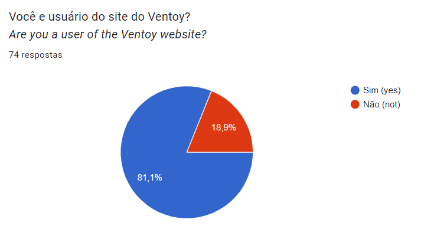
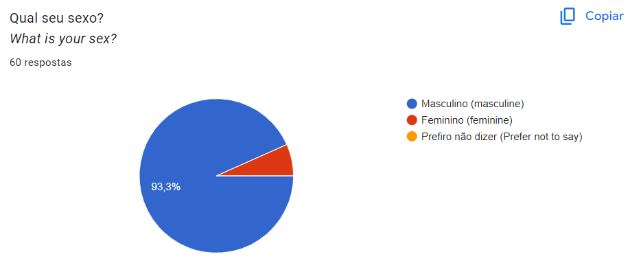
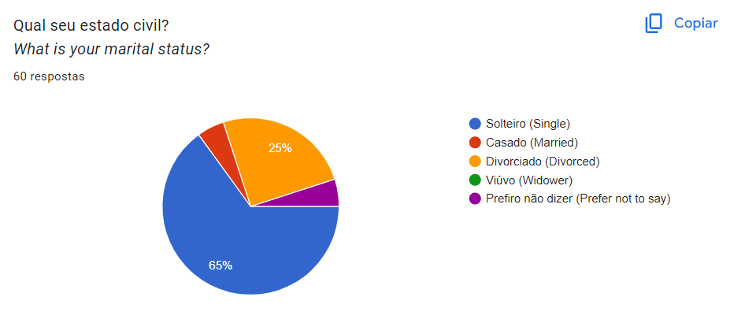
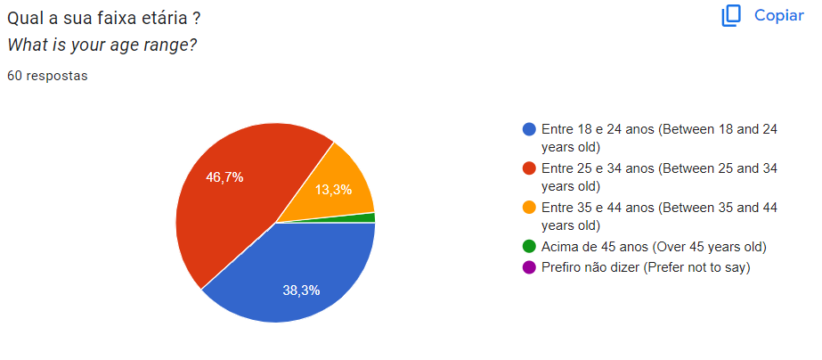
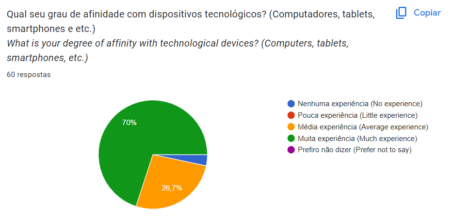
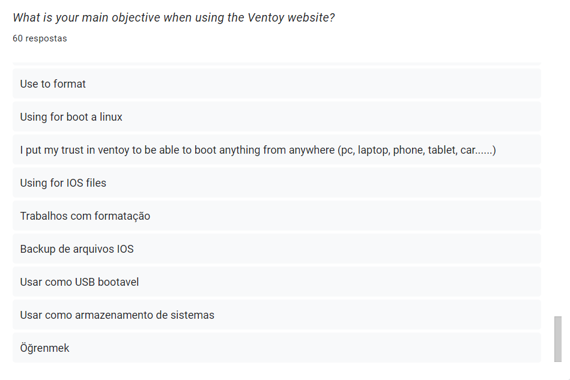
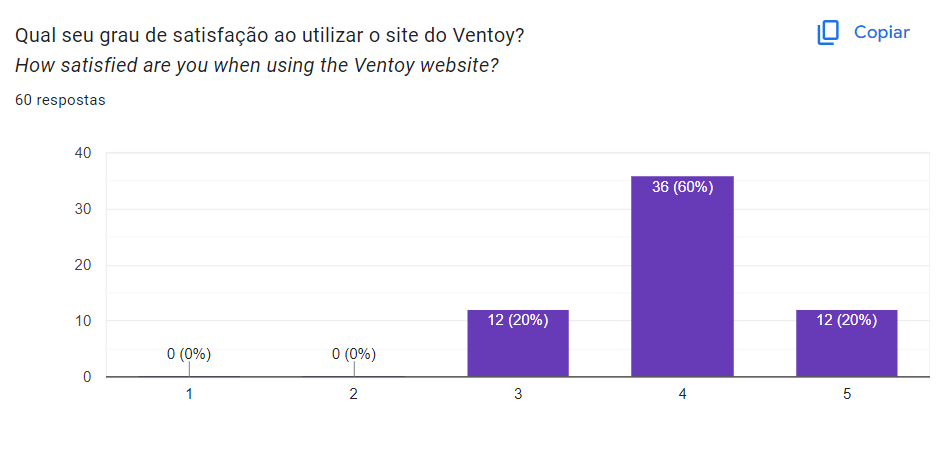
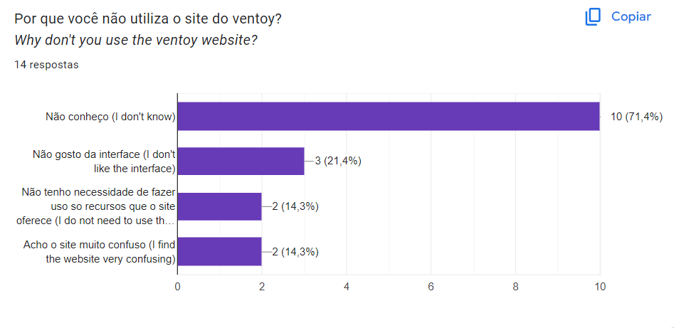

# Perfil de Usuário

## Introdução
A criação de um perfil de usuário genérico é essencial para entender profundamente os usuários de um aplicativo. Este perfil é uma representação abrangente das características, preferências, comportamentos e necessidades dos usuários de um sistema, aplicativo ou serviço. Além de identificar os usuários, ele fornece insights sobre como eles interagem com a tecnologia e quais são seus objetivos.

Os questionários são extremamente úteis neste contexto, pois permitem a coleta de dados de forma estruturada e mensurável, facilitando a análise dos dados. Eles podem ser aplicados a uma ampla gama de respondentes de maneira eficiente, possibilitando a formação de perfis de usuário que refletem uma base diversificada de usuários potenciais.

## Metodologia
Para determinar o perfil do usuário do site do Ventoy, nossa equipe criou e distribuiu um questionário. Este incluiu 8 perguntas gerais sobre os usuários e 2 adicionais para aqueles que nunca usaram o Ventoy. Os questionários foram distribuídos em fóruns da comunidade do Ventoy no Reddit e no site oficial do Ventoy, de 11 a 13 de outubro de 2023, assegurando uma amostra diversificada.

## Resultado do Questionário
Recebemos 74 respostas em conformidade com o [Termo de Consentimento](termoConsertimento.pdf). Os resultados estão ilustrados nas figuras de 1 a 9.

### Questão 1 - Você é usuário do site do Ventoy?
60 participantes (81,1%) confirmaram ser usuários do site do Ventoy, conforme mostrado no gráfico da Figura 1.

#### Figura 1 - Questão 1

Fonte: [Mayara Alves](https://github.com/Mayara-tech)

### Questão 2 - (Caso seja usuário) Qual seu gênero?
A Figura 2 mostra que a maioria dos participantes é do gênero masculino, representando 93,3% das respostas, enquanto o gênero feminino representa 6,7%.

#### Figura 2 - Questão 2

Fonte: [Mayara Alves](https://github.com/Mayara-tech)

### Questão 3 - (Caso seja usuário) Qual seu estado civil?
Conforme a Figura 3, a maioria dos participantes é solteira, com 65% das respostas, e os divorciados representam 25%.

#### Figura 3 - Questão 3

Fonte: [Mayara Alves](https://github.com/Mayara-tech)

### Questão 4 - (Caso seja usuário) Qual sua faixa etária?
A Figura 4 indica que 46,7% dos participantes têm entre 25 a 34 anos, seguidos por 38,3% na faixa de 18 a 24 anos.

#### Figura 4 - Questão 4

Fonte: [Mayara Alves](https://github.com/Mayara-tech)

### Questão 5 - (Caso seja usuário) Qual seu grau de afinidade com dispositivos tecnológicos?
Segundo a Figura 5, 70% dos participantes têm muita experiência com dispositivos tecnológicos e 26,7% têm experiência média.

#### Figura 5 - Questão 5

Fonte: [Mayara Alves](https://github.com/Mayara-tech)

### Questão 6 - (Caso seja usuário) Com qual frequência você utiliza o site do Ventoy?
A Figura 6 mostra que 76,7% dos usuários acessam o site esporadicamente e os demais 21,6% semanalmente ou diariamente.

#### Figura 6 - Questão 6

Fonte: [Mayara Alves](https://github.com/Mayara-tech)

### Questão 7 - (Caso seja usuário) Qual seu principal objetivo ao utilizar o site do Ventoy?
Na questão aberta número 7, 98,2% dos usuários mencionaram o objetivo de criar um USB bootável e 1,8% mencionaram aprendizado ou criação de inicializadores de arquivos, como ilustrado na Figura 7.

#### Figura 7 - Questão 7

Fonte: [Mayara Alves](https://github.com/Mayara-tech)

### Questão 8 - (Caso seja usuário) Qual seu grau de satisfação com o site do Ventoy?
A Figura 8 revela que os usuários estão satisfeitos com o uso do site do Ventoy.

#### Figura 8 - Questão 8

Fonte: [Mayara Alves](https://github.com/Mayara-tech)

### Questão 9 - (Caso não seja usuário) Por que você não utiliza o site do Ventoy?
A Figura 9 mostra que 71,4% dos não usuários não conhecem o site e 21,4% não o utilizam devido à interface.

#### Figura 9 - Questão 9

Fonte: [Mayara Alves](https://github.com/Mayara-tech)

## Definição do Perfil de Usuário
A análise das respostas sugere o seguinte perfil para o usuário do aplicativo:
- **Gênero:** Predominantemente masculino.
- **Idade:** Entre 25 e 34 anos.
- **Experiência:** Elevada com dispositivos tecnológicos.
- **Atitudes:** Inclinados à tecnologia.
- **Tarefas primárias:** Criação de pen-drives bootáveis.

## Referências
- BARBOSA, S. D. J.; SILVA, B. S. *Interação Humano-Computador*. Rio de Janeiro: Elsevier, 2011.
- HENRIQUE, Matheus; FERREIRA, Rafael. *Perfil do Usuário*. Repositório da disciplina de Requisitos de Software da Universidade de Brasília, 1/2023. Disponível em: [Perfil de Usuário](https://requisitos-de-software.github.io/2023.1-BilheteriaDigital/elicitacao/perfil_de_usuario/). Acesso em: 29 de setembro de 2023.

## Histórico de Versões
| Versão |    Data    | Descrição                         | Autor(es)                                           | Revisor(es)                                             |
|--------|------------|-----------------------------------|-----------------------------------------------------|---------------------------------------------------------|
| `1.0`  | 14/10/2023 | Criação do documento de perfil de usuário. | [Mayara Alves](https://github.com/Mayara-tech) | [Limirio Correia](https://github.com/LimirioGuimaraes), [Altino Arthur](https://github.com/arthurrochamoreira) |
| `2.0`  | 25/11/2023 | Melhoria na concisão do texto. | [Altino Arthur](https://github.com/arthurrochamoreira) |
