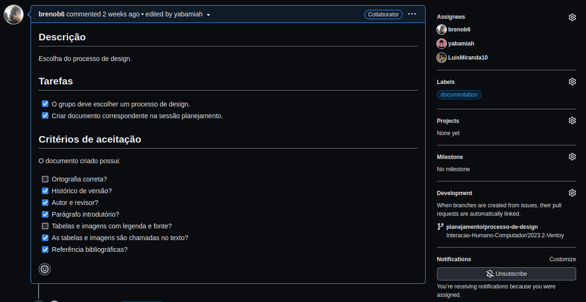

# Política

## Introdução

Vamos adotar algumas políticas de uso na ferramenta GitHub, as políticas vão auxiliar na organização,
na qualidade do projeto, promover a colaboração dos integrantes e melhorar a eficiência do desenvolvimento.

## Issue

As issues ajudam a documentar as tarefas que estão sendo desenvolvidas no projeto,
e os reponsáveis por essas tarefas. 
(GitHub Docs, About issues)

### Criação das issues

As issues podem ser criadas por qualquer membro da equipe. E devem possuir descrição informando de maneira
sucinta o artefato que está sendo trabalhado, as tarefas que serão realizadas e os critérios de aceitação
para finalizar a issue. Além disso, nas issues devem ser preenchidas os campos *Assignees* que identifica os
responsáveis pela issue, *Labels* que identifica em qual área do projeto a issue está relacionada e também
o campo *Development* que identifica qual em  qual *branch* a issue será trabalhada.

A figura 1 mostra um exemplo de *issue*.

**Figura 1** Exemplo de issue

**Fonte**: página GitHub

## Branch

Uma *branch* é uma cópia independente do código-fonte de um repositório, que permite
que diferentes desenvolvedores trabalhem em paralelo em diferentes funcionalidades
ou correções sem interferir no código principal.
(Git, gitglossary)

Os trabalhos de desenvolvimento devem sempre ser realizados em *branchs*. Isto ajuda
a manter a linha principal do repositório "limpa", ou seja, sem trabalhos incompletos
ou sem revisão.

## Pull Request

*Pull request* sinaliza que o trabalho em uma *branch* foi finalizado e que essa linha deve ser
mesclada à linha principal do projeto.
(GitHub Docs, Sobre solicitações de pull)

As solicitações de *pull request* devem ser feitas por um dos responsáveis pela issue.
E deve ser designado um revisor que será responsável por validar a solicitação, permintindo
a operação ou recusando. Se houver uma issue relacionada a essa branch, quando o *pull request*
for aceito, a *issue* automaticamente será fechada.

## Bibliografia
>About issues. **Github Docs**, disponível em: <https://docs.github.com/en/issues/tracking-your-work-with-issues/about-issues> Acesso emm: 29 de setembro 2023 
> gitglossary. **Git**, Disponível em: <https://git-scm.com/docs/gitglossary> Acesso em: 29 de setembro 2023  
> Sobre solicitação de pull, **GitHub Docs**, disponível em:
<https://docs.github.com/pt/pull-requests/collaborating-with-pull-requests/proposing-changes-to-your-work-with-pull-requests/about-pull-requests> Acesso em: 29 de setembro 2023 

## 📑 Histórico de versão

| Versão| Data      | Descrição | Autor | Revisor       |
| :-:   | :-:       | :--       | --    | --            |
| `1.0`   |18/09/2023 |Criação da página de políticas do projeto | [Breno Queiroz](https://github.com/brenob6) | [Luis Eduardo](https://github.com/LuisMiranda10) |
