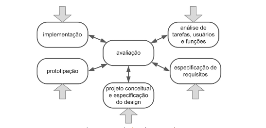

# Processo de Design de IHC

## Introdução

Design é um processo que envolve algumas atividades básicas: análise da situação
atual, síntese de uma intervenção e avaliação dessa intervenção projetada.
O processo de design irá definir como executar cada uma dessas atividades; em qual ordem e o porquê.
Existem vários tipos de processos de design de IHC, que são recomendados por diferentes autores.
(BARBOSA, SILVA, 2010, p. 99)

## Modelo Simples de Processo de Design

O modelo simples de processo de design, representado na figura 1, possui uma atividade de síntese,
chamada de re(design). É nessa etapa que os designers elaboram soluções para os requisitos propostos,
ou ajustam soluções passadas para melhor se adequar.

**Figura 01** - Ciclo Simples

**Fonte**: BARBOSA, SILVA, 2010

A simplicidade do modelo o torna flexivel e de fácil entendimento. Mas
tal caracteristica pode ser ruim para projetos mais complexos.
(BARBOSA, SILVA, 2010, p. 99)

## Ciclo de Vida em Estrela

O ciclo de vida em estrela, representado na figura 2, possui seis atividades. O interessante desse método
é que existem cinco pontos de entrada, e não existe ordem definida para execução das atividades,
exceto a de avaliação que deve ser feita após todas as outras.

**Figura 2** - Ciclo em Estrela

**Fonte**: BARBOSA, SILVA, 2010

Nessa etapa o designer verifica, se os requisitos especificados estão sendo satisfeitos e
se existem problemas de usabilidade nas representações de design, nos protótipos e no sistema final. 
(BARBOSA, SILVA, 2010, p. 103-104)

## Engenharia de Usabilidade de Nielsen

Nielsen definiu um conjunto de dez atividades que devem ocorrer durantetodo o ciclo de vida do produto.
A tabela 01 faz uma breve descrição de cada atividade.

**Tabela 01** - atividades de Nielsen

| Etapa | Tarefa    | Descrição |
| :-:   | :-        | :-       | 
| 1 |Conhecer o usuário     | Estudar os usuários e os usos pretendidos do produto |
| 2 | Análise competitiva   | Examinar produtos com funcionalidade semelhantes |
| 3 | Definir metas de usabilidade | Definir fatores de qualidade que devem ser priorizados no projeto |
| 4 | Designs paralelos     | Elaborar diferentes alternativas de design |
| 5 | Design participativo  | Obter opiniões de usuários através de protótipos, maquetes ou esboços | 
| 6 | Design coordenado da interface | Deve haver um responsável pela interface para eveitar incosistências |
| 7 | Análise heurística    | A interface deve seguir diretrizes |
| 8 | Protótipos            | Protótipos devem ser feitos antes da implementação da interface com usuário |
| 9 | Testes empíricos      | Utilizar os protótipos para realizar testes de observação dos usuários |
| 10| Design iterativo      | A partir dos problemas de usabilidade e dos testes empíricos repassar pelas atividades do processo |

**Fonte:** BARBOSA, SILVA, 2010

## Engenharia de Usabilidade de Mayhew

Mayhew propôs um processo de design com uma gama maior de detalhes. Nele as atividades são
dividas em três tipos de fases, como pode ser observado na figura 3.

**Figura 3** - Ciclo de Mayhew

**Fonte:** MAYHEW, 1999 apud, BARBOSA, SILVA, 2010

Na primeira fase é definido os requisitos e as metas de usabilidade, com base no perfil dos usuários,
nas tarefa

Após a fase inicial, começa o processo de desenvolvimeto de solução de IHC. Essa etapa é
separada em três níveis, alguns pontos chaves de cada um são:

- **Nível 1**: Elaboração de alternativas de solução do modelo conceitual; elaboração de protótipo de baixa fidelidade;
- **Nível 2**: Estabelecer padrões de design de IHC; construção de protótipo de média fidelidade;
- **Nível 3**: Protótipo de alta fidelidade;

Por fim, é coletado opiniões dos usuários, para verificar possíveis melhorias.
(BARBOSA, SILVA, 2010, p. 109-111)

## Escolha do Processo de Design

Baseado em uma análise feita minuciosamente a respeito de toda as alternativas, chegamos em um concesso
geral que o ciclo de Mayhew seria o mais apropriado e eficaz para o projeto como o todo, uma vez que
nos é fornecido uma estrutura abrangente para a gestão de projeto que, por sua vez, é bastante rica em
detalhes, se comparado aos outros processos de design citados neste documento.

O ciclo Mayhew será seguido de forma integral, e começaremos o processo pela análise de requisitos.
Nessa etapa, vamos definir as metas de usabilidade para o site escolhido, o perfil dos usuários,
análises de tarefas e possíveis limitações da plataforma. Posteriormente vamos desenvolver uma
solucação de IHC para atender as metas de usabilidades estabelecidades na etapa anterior. Nessa etapa
está incluso, reengenharia do trabalho, que visa encontrar possíveis melhorias para a interface;
a elaboração de protótipos de baixa, média e alta fidelidade, que deverão ser avaliados por usuários.

Na fase de instalação, o objetivo é coletar opiniões de usuários para futuramente melhorar ainda mais
o sistema e desenvolver novas funcionalidade em versões futuras.

## Bibliografia

> BARBOSA, Simone; SILVA, Bruno. **Interação Humano-Computador**, Editora Elsevier, Rio de Janeiro, 2010

## Histório de versão

**Tabela 2** - Histórico de Versão

| Versão| Data      | Descrição | Autor | Revisor       |
| :-:   | :-:       | :--       | --    | --            |
| 1.0   |16/09/2023 |Criação da página Processo de Design de IHC|[Breno](https://github.com/brenob6) e [Luis Miranda](https://github.com/luismiranda10)|[Vinícius Mendes](https://github.com/yabamiah)   |
| 2.0   |08/10/2023 |Correção da página após primeira apresentação| [Breno](https://github.com/brenob6)|                   |

