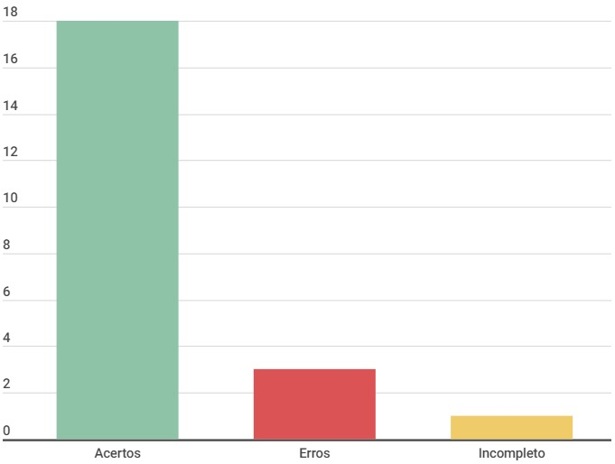

# Planejamento da avaliação da análise de tarefas

## Introdução

Este documento é uma verificação do artefato [Planejamento da avaliação da análise de tarefas](../../../DAD/nivel1/AnaliseTarefas/planejamento.md) na versão 1.0 de data 29/10/2023, autorado por [Limirio Guimarães](https://github.com/LimirioGuimaraes), [Mayara Alves](https://github.com/Mayara-tech) e [Breno Queiroz](https://github.com/brenob6), que são integrantes do [grupo 02](https://github.com/Mayara-tech), cujo projeto tem como foco o [Site Ventoy](https://www.ventoy.net/en/index.html), o propósito desta verificação é identificar possíveis problemas no artefato.

## Metodologia 

A verificação do artefato seguirá o [planejamento](../../verificacao/planejamendoDaVerificacao.md) estabelecido pelo nosso grupo. Conforme detalhado no planejamento, destaca-se a relevância do subtópico da metodologia neste documento, para apresentar a tabela contendo os checklists utilizados para realizar essa verificação deste artefato em específico. Podemos observar o referido checklist referente a verificação do Cronograma na Tabela 1, as perguntas foram tiradas da verificação do [planejamento da avaliação da análise de tarefas](../../../verificacao/DAD/nivel01/analiseDeTarefas/planejamento_avalicao_analise_de_tarefas.md) feita pelo grupo.

**Tabela 1** - Checklist

| ID | Descrição                                                                           | Avaliação  | Observação |
|----|-------------------------------------------------------------------------------------|------------|------------|
| 1  | O histórico de versão é padronizado?                                                |      -     |     -      |
| 2  | Possui o(s) autor(es) e o(s) revisor(es) do artefato?                               |      -     |     -      |
| 3  | O artefato possui referências bibliográficas e/ou bibliografia?                     |      -     |     -      |
| 4  | Todas as tabelas e imagens são chamadas no texto, possuem legendas e fontes?        |      -     |     -      |
| 5  | Todos os textos estão na norma padrão?                                              |      -     |     -      |
| 6  | Há introdução do artefato?                                                          |      -     |     -      |
| 7 | Os objetivos definidos na primeira atividade, são objeto de avaliação de IHC? (Analisar apropriação da tecnologia, comparar ideas e alternativas de design, verificar conforrmidade com um padrão, identificar problemas na interação e interface) | - | - |
| 8 | Na atividade de explorar perguntas, algumas questões abordadas teve com base no trabalho de Interação Humano Computador de Simone Barbosa e Bruno Diniz? | - | - | 
| 9 | Na atividade de escolher métodos, foi dito quais tipos de avaliação foram escolhidos? (Investigação, inspeção e observação) | - | -  |
| 10 | Na atividade escolher métodos, foi descrito qual método escolhido dos tipos de avaliações definidos? (Avaliação heurística, percurso cognitivo, teste de usabilidade, etc...) | - | - |
| 11 | Na atividade de identificar questões práticas, foi descrito o processo  de recrutamento? (Quantidade de participantes, perfil de usuários) |-  | - |
| 12 | Na atividade de identificar questões práticas, foi descrito como será feito a preparação dos avaliadores? | - | - |
| 13 | Na atividade de identificar questões prática, foi descrito por qual meio seria realizado a avaliação? | - | - | 
| 14 | Na atividade de identificar questões práticas, foi descrito quais recursos serão necessários para realização da avaliação? | - | - |
| 15 | Na atividade de identificar questões práticas, foi descrito os cursos do grupo para a realização da avaliação? | - | - |
| 16 | Na atividade de identificar questões práticas, foi demonstrado o cronograma das avaliações? (Data, horários, avaliadores, participantes, local) | - | - | 
| 17 | Na atividade de identificar questões práticas, foi descrito qual o roteiros de perguntas ou questões será feito? | - | - |
| 18 | Na atividade de questões éticas, foi deixado claro qual termo de consentimento será utilizado e apresentado para os participantes? | - | -|
| 19 | Na atividade de interpretação dos dados, foi descrito qual forma de apresentação da conclusão e dos dados será utilizada? (Tabelas, gráficos)
| 20 | Foi feito o planejamento do teste piloto? (Entrevistador, participante, horários, data e local) | - | - |
| 21 | Foi realizado o teste piloto? | - | - |
| 22 | O teste piloto foi gravado? | - | - |

Fonte: [Milena Baruc](https://github.com/MilenaBaruc)

## Desenvolvimento

Na tabela 2 podemos observar o checklist preenchido após verificação do artefato. Este checklist, minuciosamente preenchido, reflete os resultados, observações e considerações resultantes da análise realizada no artefato. A inspeção foi feita por meio de uma gravação individual, que está presentes na tabela 3.

**Tabela 2** - Checklist preenchido

| ID | Descrição                                                                           | Avaliação  | Observação |
|----|-------------------------------------------------------------------------------------|------------|------------|
| 1  | O histórico de versão é padronizado?                                                | Sim |     -      |
| 2  | Possui o(s) autor(es) e o(s) revisor(es) do artefato?                               | Sim |     -      |
| 3  | O artefato possui referências bibliográficas e/ou bibliografia?                     | Sim |     -      |
| 4  | Todas as tabelas e imagens são chamadas no texto, possuem legendas e fontes?        | Incompleto | Vídeo 1 está sem o '1' no título do vídeo, duas tabelas 1, tabela 1 sem fonte, tem uma tabela sem legenda fonte e sem chamamento |
| 5  | Todos os textos estão na norma padrão?                                              | Sim |     -      |
| 6  | Há introdução do artefato?                                                          | Sim |     -      |
| 7 | Os objetivos definidos na primeira atividade, são objeto de avaliação de IHC? (Analisar apropriação da tecnologia, comparar ideas e alternativas de design, verificar conforrmidade com um padrão, identificar problemas na interação e interface) | Sim | - |
| 8 | Na atividade de explorar perguntas, algumas questões abordadas tiveram com base no trabalho de Interação Humano Computador de Simone Barbosa e Bruno Diniz? | Sim | - | 
| 9 | Na atividade de escolher métodos, foi dito quais tipos de avaliação foram escolhidos? (Investigação, inspeção e observação) | Não | -  |
| 10 | Na atividade escolher métodos, foi descrito qual método escolhido dos tipos de avaliações definidos? (Avaliação heurística, percurso cognitivo, teste de usabilidade, etc...) | Sim | - |
| 11 | Na atividade de identificar questões práticas, foi descrito o processo  de recrutamento? (Quantidade de participantes, perfil de usuários) | Sim | - |
| 12 | Na atividade de identificar questões práticas, foi descrito como será feito a preparação dos avaliadores? | Sim | - |
| 13 | Na atividade de identificar questões prática, foi descrito por qual meio seria realizado a avaliação? | Sim | - | 
| 14 | Na atividade de identificar questões práticas, foi descrito quais recursos serão necessários para realização da avaliação? | Não | - |
| 15 | Na atividade de identificar questões práticas, foi descrito os custos do grupo para a realização da avaliação? | Não | - |
| 16 | Na atividade de identificar questões práticas, foi demonstrado o cronograma das avaliações? (Data, horários, avaliadores, participantes, local) | Sim | - |
| 17 | Na atividade de identificar questões práticas, foi descrito qual o roteiros de perguntas ou questões será feito? | Sim | - |
| 18 | Na atividade de questões éticas, foi deixado claro qual termo de consentimento será utilizado e apresentado para os participantes? | Sim | -|
| 19 | Na atividade de interpretação dos dados, foi descrito qual forma de apresentação da conclusão e dos dados será utilizada? (Tabelas, gráficos) | Sim | - |
| 20 | Foi feito o planejamento do teste piloto? (Entrevistador, participante, horários, data e local) | Sim | - |
| 21 | Foi realizado o teste piloto? | Sim | - |
| 22 | O teste piloto foi gravado? | Sim | - |

Fonte: [Milena Baruc](https://github.com/MilenaBaruc)

**Tabela 3** - Cronograma de verificação

| Participantes | Data | Horário | Link da gravação | Minutagem aonde começa |
| -------------------------------------------------------------------------------------------- | ---------- | ----- | ------------------- | ------------- |
| [Milena Baruc](https://github.com/MilenaBaruc)                                               | 02/12/2023 | 17:00/17:30 | [Verificação individual](https://youtu.be/hrXHrD7gICk)       | 00:10:40 |
Fonte: [Milena Baruc](https://github.com/MilenaBaruc) 

## Dados gráficos

Segue no gráfico 1, o gráfico onde podemos ver com maior facilidade os erros, acertos e incompletos do artefato.

**Gráfico 1** - Dados visuais

Fonte: [Milena Baruc](https://github.com/MilenaBaruc)

## Sugestões de Melhorias

Em geral, o artefato está bom, precisa de algumas adições. Sendo assim, as sugestôes de melhorias são:

• Arrumar as tabelas/vídeo: Vídeo 1 está sem o '1' no título do vídeo, duas tabelas 1, tabela 1 sem fonte, tem uma tabela sem legenda fonte e sem chamamento;
• Descrever qual tipo de avaliação foi escolhido;
• Adicionar quais recursos e custos irão ser utlizados durante a avaliação.

## Referência Bibliografica

> 1. Ventoy. Interacao-Humano_computador. Distrito Federal, 2023. Disponível em: <https://interacao-humano-computador.github.io/2023.2-Ventoy/>. Acesso em: 02/12/2023.

## Bibliografia

> BARBOSA, S. D. J.; Silva, B. S. da; Silveira, M. S.; Gasparini, I.; Darin, T.; Barbosa, G. D. J. (2021);Interação Humano-Computador e Experiência do usuário.

## 📑 Histórico de Versões

| Versão | Data       | Descrição                                       | Autor                                          | Revisor                                      |
| ------ | ---------- | ----------------------------------------------- | -----------------------------------------------| ---------------------------------------------|
| `1.0`  | 02/12/2023 | Criação do Documento | [Milena Baruc](https://github.com/MilenaBaruc)  | [Altino Arthur](https://github.com/arthurrochamoreira)|
