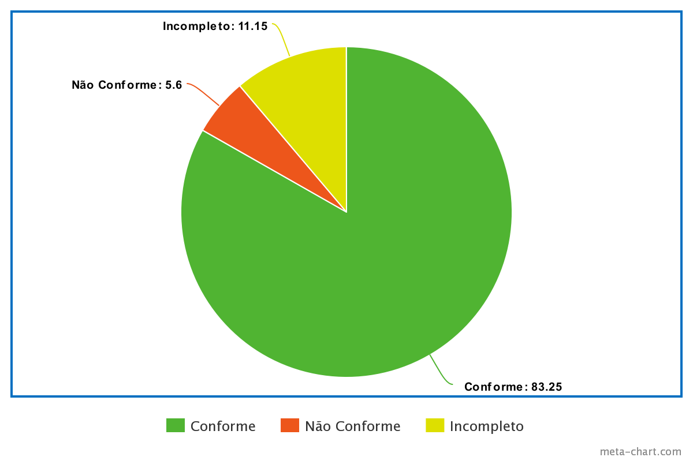

# Verificação Relato dos Resultados do Protótipo "Acessar a Aba de Plugin"

## Introdução

Este documento é uma verificação do artefato [Acessar a Aba de Plugin](https://interacao-humano-computador.github.io/2023.2-Ventoy/DAD/nivel2/prototipoDePapel/RelatoPlugin/) na versão 1.1 de data 22/11/2023, autorada por [Milena Baruc](https://github.com/MilenaBaruc), que é integrante do [grupo 02](https://github.com/Interacao-Humano-Computador/2023.2-Ventoy/tree/main), 
cujo projeto tem como foco o site do [Ventoy](https://www.ventoy.net/en/index.html), o propósito desta verificação é identificar possíveis problemas no artefato.

## Metodologia 

A verificação do artefato seguirá o [planejamento](https://interacao-humano-computador.github.io/2023.2-Ventoy/) estabelecido pelo nosso grupo. Conforme detalhado no planejamento, 
destaca-se a relevância do subtópico da metodologia neste documento, para apresentar a tabela contendo os checklists utilizados para realizar essa verificação deste artefato em específico. 
Podemos observar o referido checklist referente a verificação do Cronograma na Tabela 1. 

**Tabela 1** - Checklist não preenchido

| ID | Descrição                                                                                                                      | Avaliação  | Observação                                                             |
|----|--------------------------------------------------------------------------------------------------------------------------------|------------|------------------------------------------------------------------------|
| 1  | O artefato possui Introdução?                                                                                                  | -          | -                                                                      |
| 2  | O artefato possui a metodologia utilizada?                                                                    		      | -          | -                                                                      |
| 3  | O artefato possui bibliografia/referências bibliográficas?                                                                     | -          | -                                                                      |
| 4  | O artefato possui um histórico de versões com o id e descrição das versões, data, autores e revisores?                         | -          | -                                                                      |
| 5  | Todas as tabelas e imagens são chamadas no texto, possuem legendas e fontes?                                                   | -          | -                                                                      |
| 6  | Todos os textos estão na norma padrão?                                       						      | -          | -                                                                      |
| 7  | Define objetivo e escopo de avaliação dos resultados?					   				      | -          | -                                                                      |
| 8  | Define o método de avaliação dos resultados?		                                                                      | -          | -                                                                      |
| 9  | O relato apresenta os participantes e suas funções?		                                                              | -          | -                                                                      |
| 10  | O perfil de usuário do participante selecionado se enquadram no perfil de usuário?					      | -          | -  								    |
| 11  | Apresenta as sugestões de melhorias?								                              | -          | -  								    |
| 12  | Apresenta uma seção para o feedback dos usuários?						                              | -          | -  								    |
| 13  | Aborda como foi realizada a análise da interação do usuário com o artefato?						      | -          | -  								    |
| 14  | Define um tópico para sumarizar os principais resultados?								      | -          | -  								    |
| 15  | O resultado relembra quais foram os motivos para a realização do estudo?						      | -          | -  								    |
| 16  | Considera um planejamento para o reprojeto do sistema?									      | -          | -  								    |
| 17  | Apresenta um cronograma realizado		?									      | -          | -  								    |
| 18  | O relato segue um padrão consolidado para todos os outros relatos?							      | -          | -  								    |

Fonte: [Limirio Guimarães](https://github.com/LimirioGuimaraes)

## Desenvolvimento 

Na tabela 2 podemos observar o checklist preenchido após verificação do artefato. Este checklist, reflete os resultados, observações e considerações resultantes da análise realizada no artefato.

**Tabela 2** - Checklist Preenchido 

| ID | Descrição                                                                                                                      | Avaliação  | Observação                                                             |
|----|--------------------------------------------------------------------------------------------------------------------------------|------------|------------------------------------------------------------------------|
| 1  | O artefato possui Introdução?                                                                                                  | Conforme   | -                                                                      |
| 2  | O artefato possui a metodologia utilizada?                                                                    		      | Conforme   | -                                                                      |
| 3  | O artefato possui bibliografia/referências bibliográficas?                                                                     | Conforme   | -                                                                      |
| 4  | O artefato possui um histórico de versões com o id e descrição das versões, data, autores e revisores?                         | Conforme   | - 						|
| 5  | Todas as tabelas e imagens são chamadas no texto, possuem legendas e fontes?                                                   | Conformr   | - |
| 6  | Todos os textos estão na norma padrão?                                       						      | Conforme   | -                                                                      |
| 7  | Define objetivo e escopo de avaliação dos resultados?					   				      | Conforme   | -                                                                      |
| 8  | Define o método de avaliação dos resultados?		                                                                      | Conforme   | -                                                                      |
| 9  | O relato apresenta os participantes e suas funções?		                                                              | Conforme   | -                                                                      |
| 10  | O perfil de usuário do participante selecionado se enquadram no perfil de usuário?					      | Conforme   | -  								    |
| 11  | Apresenta as sugestões de melhorias?								                              | Não Conforme| -  								    |
| 12  | Apresenta uma seção para o feedback dos usuários?						                              | Conforme| -  								    |
| 13  | Aborda como foi realizada a análise da interação do usuário com o artefato?						      | Incompleto | -  								    |
| 14  | Define um tópico para sumarizar os principais resultados?								      | Conforme   | -  								    |
| 15  | O resultado relembra quais foram os motivos para a realização do estudo?						      | Conforme| -  								    |
| 16  | Considera um planejamento para o reprojeto do sistema?									      | Não Conforme          | -  						   	|
| 17  | Apresenta um cronograma realizado?											      | Conforme   | -  								    |
| 18  | O relato segue um padrão consolidado para todos os outros relatos?							      | Conforme   | -  								    |

Fonte: [Limirio Guimarães](https://github.com/LimirioGuimaraes)

## Sugestões de Melhorias

Documentar melhor como a entrevista ocorreu explicitando como o usuário interagiu com o sistema apresentado.

## Acompanhamento

A figura 1 apresenta um gráfico com o percentual de respostas conforme, não conforme, incompleto ou não se aplica, obtidas através da checklist de verificação.

**Figura 1** - Percentual das respostas obtidas na verificação 

Fonte: [Limirio Guimarães](https://github.com/LimirioGuimaraes)

### Percentual de aproveitamento 

Para saber a porcentagem de aproveitamento do artefato, será utilizado a Equação na figura 2:

**Figura 2** - Equação de percentual de aproveitamento

Fonte: [Limirio Guimarães](https://github.com/LimirioGuimaraes)

Através dos checklists realizados podemos observar que:

- 15/18 exigências são atendidas (Conformes);
- 1/18 exigências estão incompletas;
- 2/18 exigências estão erradas ou não foram realizadas (Não conformes).
- 0/18 não se aplica.

Onde 18 é a quantidade de itens avaliados na verificação.

Portanto, com base no cálculo apresentado, pode-se dizer que o aproveitamento deste artefato está em 61,11%.

## Retrabalho

Como apresentado no [planejamento](), para o retrabalho a autora do artefato [Milena Baruc](https://github.com/MilenaBaruc) que irá fazer as correções dos problemas apresentados pela verificação. O responsável por essa verificação fará uma revisão das correções feitas, checando se as correções são suficientes e se foi introduzido novos erros ou não. A tabela 3 a seguir apresenta o cronograma de correções.

**Tabela 3** - Cronograma de Correções

| Data de Correção | Descrição                                    |                Responsável(eis)                |                 Revisor(es)                 |      Status      |
| :--------------: | :------------------------------------------- | :--------------------------------------------: | :-----------------------------------------: | :--------------: |
|    05/12/2023    | Corrigir erros encontrados pela verificação  |[Milena Baruc](https://github.com/MilenaBaruc) | [Limirio Guimarães](https://github.com/LimirioGuimaraes)|  |

Fonte: [Limirio Guimarães](https://github.com/LimirioGuimaraes)

## Bibliografia

> BARBOSA, S. D. J.; Silva, B. S. da; Silveira, M. S.; Gasparini, I.; Darin, T.; Barbosa, G. D. J. (2021);Interação Humano-Computador e Experiência do usuário. 
> BILHETERIA DIGITAL. Interacao-Humano_computador. Distrito Federal, 2023. Disponível em: <https://interacao-humano-computador.github.io/2023.1-BilheteriaDigital/>. Acesso em: 10/11/2023. 

## 📑 Histórico de Versões

| Versão |    Data    |       Descrição      | Autor                |   Revisor   |
| ------ | ---------- | -------------------- | ---------------------| ----------- |
| `1.0`  | 25/11/2023 | Criação do Documento | [Limirio Guimarães](https://github.com/LimirioGuimaraes)| |
| `1.1`  | 04/12/2023 | Adicionado o desenvolvimento | [Limirio Guimarães](https://github.com/LimirioGuimaraes)| |
