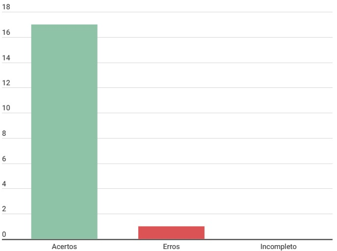

# Acessar a página de Testes de ISO para verificar os testes

## Introdução

Este documento é uma verificação do artefato [Acessar a página de Testes de ISO para verificar os testes](../../../../DAD/nivel2/prototipoDePapel/RelatoTesteISO.md) na versão 1.0 de data 22/11/2023, autorado por [Luis Miranda](https://github.com/LuisMiranda10), que é integrante do [grupo 02](https://github.com/Mayara-tech), cujo projeto tem como foco o [Site Ventoy](https://www.ventoy.net/en/index.html), o propósito desta verificação é identificar possíveis problemas no artefato do cronograma. 

## Metodologia

A verificação do artefato seguirá o [planejamento](../../verificacao/planejamendoDaVerificacao.md) estabelecido pelo nosso grupo. Conforme detalhado no planejamento, destaca-se a relevância do subtópico da metodologia neste documento, para apresentar a tabela contendo os checklists utilizados para realizar essa verificação deste artefato em específico. Podemos observar o referido checklist referente a verificação do Cronograma na Tabela 1, as perguntas foram criadas pelo grupo para utilizarmos nas verificações dos artefatos de relato dos prótotipos de papel.

**Tabela 1** - Checklist

| ID | Descrição                                                                           | Avaliação  | Observação |
|----|-------------------------------------------------------------------------------------|------------|------------|
| 1  | O histórico de versão é padronizado?                                                |      -     |     -      |
| 2  | Possui o(s) autor(es) e o(s) revisor(es) do artefato?                               |      -     |     -      |
| 3  | O artefato possui referências bibliográficas e/ou bibliografia?                     |      -     |     -      |
| 4  | Todas as tabelas e imagens são chamadas no texto, possuem legendas e fontes?        |      -     |     -      |
| 5  | Todos os textos estão na norma padrão?                                              |      -     |     -      |
| 6  | Há introdução do artefato?                                                          |      -     |     -      |
| 7  | Define objetivo e escopo de avaliação dos resultados?   				               |      -     |     -      |
| 8  | Define o método de avaliação dos resultados?		                                   |      -     |     -      |
| 9  | O relato apresenta os participantes e suas funções?                                 |      -     |     -      |
| 10  | O perfil de usuário do participante selecionado se enquadram no perfil de usuário? |      -     |     -      |
| 11  | Apresenta as sugestões de melhorias?								               |      -     |     -      |
| 12  | Apresenta uma seção para o feedback dos usuários?						           |      -     |     -      |
| 13  | Aborda como foi realizada a análise da interação do usuário com o artefato?        |      -     |     -      |
| 14  | Define um tópico para sumarizar os principais resultados?						   |      -     |     -      |
| 15  | O resultado relembra quais foram os motivos para a realização do estudo?	       |      -     |     -      |
| 16  | Considera um planejamento para o reprojeto do sistema?					           |      -     |     -      |
| 17  | Apresenta um cronograma realizado?									               |      -     |     -      |
| 18  | O relato segue um padrão consolidado para todos os outros relatos?				   |      -     |     -      |

Fonte: [Milena Baruc](https://github.com/MilenaBaruc)

## Desenvolvimento

Na tabela 2 podemos observar o checklist preenchido após verificação do artefato. Este checklist, minuciosamente preenchido, reflete os resultados, observações e considerações resultantes da análise realizada no artefato. A inspeção foi feita por meio de uma gravação individual, que está presentes na tabela 3.

**Tabela 2** - Checklist preenchido

| ID | Descrição                                                                           | Avaliação  | Observação |
|----|-------------------------------------------------------------------------------------|------------|------------|
| 1  | O histórico de versão é padronizado?                                                | Sim |     -      |
| 2  | Possui o(s) autor(es) e o(s) revisor(es) do artefato?                               | Sim |     -      |
| 3  | O artefato possui referências bibliográficas e/ou bibliografia?                     | Sim |     -      |
| 4  | Todas as tabelas e imagens são chamadas no texto, possuem legendas e fontes?        | Sim |     -      |
| 5  | Todos os textos estão na norma padrão?                                              | Sim |     -      |
| 6  | Há introdução do artefato?                                                          | Sim |     -      |
| 7  | Define objetivo e escopo de avaliação dos resultados?   				               | Sim |     -      |
| 8  | Define o método de avaliação dos resultados?		                                   | Sim |     -      |
| 9  | O relato apresenta os participantes e suas funções?                                 | Sim |     -      |
| 10  | O perfil de usuário do participante selecionado se enquadram no perfil de usuário? | Sim |     -      |
| 11  | Apresenta as sugestões de melhorias?								               | Sim |     -      |
| 12  | Apresenta uma seção para o feedback dos usuários?						           | Sim |     -      |
| 13  | Aborda como foi realizada a análise da interação do usuário com o artefato?        | Sim |     -      |
| 14  | Define um tópico para sumarizar os principais resultados?						   | Sim |     -      |
| 15  | O resultado relembra quais foram os motivos para a realização do estudo?	       | Sim |     -      |
| 16  | Considera um planejamento para o reprojeto do sistema?					           | Não |     -      |
| 17  | Apresenta um cronograma realizado?		          							       | Sim |     -      |
| 18  | O relato segue um padrão consolidado para todos os outros relatos?				   | Sim |     -      |

Fonte: [Milena Baruc](https://github.com/MilenaBaruc)

**Tabela 3** - Cronograma de verificação

| Participantes | Data | Horário | Link da gravação | Minutagem aonde começa |
| -------------------------------------------------------------------------------------------- | ---------- | ----- | ------------------- | ------------- |
| [Milena Baruc](https://github.com/MilenaBaruc)                                               | 02/12/2023 | 17:00/17:30 | [Verificação individual](https://youtu.be/hrXHrD7gICk)       | 00:19:20 |

Fonte: [Milena Baruc](https://github.com/MilenaBaruc) 

## Dados gráficos

Segue no gráfico 1, o gráfico onde podemos ver com maior facilidade os erros, acertos e incompletos do artefato.

**Gráfico 1** - Dados visuais

Fonte: [Milena Baruc](https://github.com/MilenaBaruc)

## Sugestões de Melhorias

Em geral, o artefato está ótimo, só precisa de uma melhoria. Sendo assim, a sugestão de melhoria é:

• Adicionar um planejamento para o reprojeto do sistema.

## Referência Bibliografica

> 1. Ventoy. Interacao-Humano_computador. Distrito Federal, 2023. Disponível em: <https://interacao-humano-computador.github.io/2023.2-Ventoy/>. Acesso em: 02/12/2023.

## Bibliografia 

> BARBOSA, S. D. J.; Silva, B. S. da; Silveira, M. S.; Gasparini, I.; Darin, T.; Barbosa, G. D. J. (2021);Interação Humano-Computador e Experiência do usuário.

## 📑 Histórico de Versões

| Versão | Data       | Descrição                                       | Autor                                          | Revisor                                      |
| ------ | ---------- | ----------------------------------------------- | -----------------------------------------------| ---------------------------------------------|
| `1.0`  | 02/12/2023 | Criação do Documento | [Milena Baruc](https://github.com/MilenaBaruc)  | [nome](https://github.com/)|