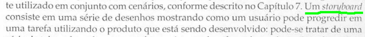
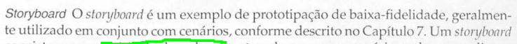
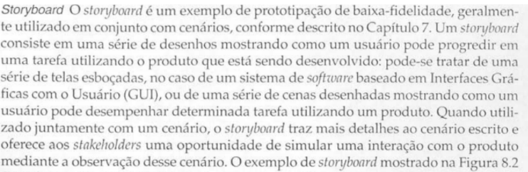

# Storyboards
## Introdução

Este documento é uma verificação do artefato [Storyboards](https://interacao-humano-computador.github.io/2023.2-Ventoy/DAD/nivel1/storyboard/storyboards/) na versão 1.7 de data 20/11/2023, autorado por [Mayara Alves](https://github.com/Mayara-tech), que é integrante do [grupo 02](https://github.com/Requisitos-de-Software/2023.2-Carteira_Digital_de_Transito), cujo projeto tem como foco o [Aplicativo Carteira Digital de Trânsito](https://play.google.com/store/apps/details?id=br.gov.serpro.cnhe&hl=pt_BR&gl=US), o propósito desta verificação é identificar possíveis problemas no artefato.

## Metodologia

A verificação do artefato seguirá o [planejamento](https://github.com/Requisitos-de-Software/2023.2-Carteira_Digital_de_Transito/blob/main/docs/verificacao/grupo2/planejamentoDaVerificacao.md) estabelecido pelo nosso grupo. Conforme detalhado no planejamento, destaca-se a relevância do subtópico da metodologia neste documento, para apresentar a tabela contendo os checklists utilizados para realizar essa verificação deste artefato em específico. Podemos observar o referido checklist referente a verificação do Cronograma na Tabela 1, as perguntas foram tiradas da verificação da [Storyboards]([https://requisitos-de-software.github.io/2023.2-Carteira_Digital_de_Transito/modelagem/cenarios/](https://interacao-humano-computador.github.io/2023.2-Ventoy/DAD/nivel1/storyboard/storyboards/)) feita anterirormente pelo grupo.

**Tabela 1** - Checklist Geral

| ID | Critério de Avaliação                           | Avaliação ( Sim/ Não / Não Aplicável )             | Observações                       | Referências                                                    |
|----| ------------------------------------------------|----------------------------------------------------|-----------------------------------|----------------------------------------------------------------|
| 1  | O histórico de versão é padronizado?                                           |     Sim       |            |  REQUISITOS DE SOFTWARE. Carteira Digital de Trânsito. Distrito Federal, 2023. Disponível em: <https://github.com/Requisitos-de-Software/2023.2-Carteira_Digital_de_Transito/>. Acesso em: 02/12/2023.          |            
| 2  | Possui o(s) autor(es) e o(s) revisor(es) do artefato?                          |     Sim       |            |  REQUISITOS DE SOFTWARE. Carteira Digital de Trânsito. Distrito Federal, 2023. Disponível em: <https://github.com/Requisitos-de-Software/2023.2-Carteira_Digital_de_Transito/>. Acesso em: 02/12/2023.          | 
| 3  | O artefato possui referências bibliográficas e/ou bibliografia?                |     Sim       |            |  REQUISITOS DE SOFTWARE. Carteira Digital de Trânsito. Distrito Federal, 2023. Disponível em: <https://github.com/Requisitos-de-Software/2023.2-Carteira_Digital_de_Transito/>. Acesso em: 02/12/2023.          | 
| 4  | Todos os textos estão na norma padrão?                                         |     Sim       |            |   REQUISITOS DE SOFTWARE. Carteira Digital de Trânsito. Distrito Federal, 2023. Disponível em: <https://github.com/Requisitos-de-Software/2023.2-Carteira_Digital_de_Transito/>. Acesso em: 02/12/2023.         | 
| 5  | Há introdução do artefato?                                                     |     Sim       |            |    REQUISITOS DE SOFTWARE. Carteira Digital de Trânsito. Distrito Federal, 2023. Disponível em: <https://github.com/Requisitos-de-Software/2023.2-Carteira_Digital_de_Transito/>. Acesso em: 02/12/2023.        | 
| 6  | Há metodologia de como foi conduzido o artefato?                               |     Sim       |            |  REQUISITOS DE SOFTWARE. Carteira Digital de Trânsito. Distrito Federal, 2023. Disponível em: <https://github.com/Requisitos-de-Software/2023.2-Carteira_Digital_de_Transito/>. Acesso em: 02/12/2023.          | 

Fonte: [Vinícius Mendes](https://github.com/yabamiah)

**Tabela 2** - Checklist Específico

| ID | Critério de avaliação | Avaliação (Sim/Não/Não aplicável) | Observações | Referências | Imagem da Referência |
|---|----------------------|------------------------------------|---------------|--------------|-------------|
|01| Os storyboards são representados como um conjunto desenhos de um usuário progredindo em uma tarefa do aplicativo do projeto? | | | Página: 263, Capítulo 8. Design, Prototipação e Construção. Livro: PREECE, ROGERS ESHARP, Design De Interação - Além da interação homem-computador, 3a. Edição, Editora Bookman, 2013.| |
|02| Os dos desenhos dos storyboards são representados em um conjunto de cenários? | | |  Página: 263, Capítulo 8. Design, Prototipação e Construção. Livro: PREECE, ROGERS E SHARP, Design De Interação - Além da interação homem-computador, 3a. Edição, Editora Bookman, 2013.| |
|03| Os storyboards conseguem retratar o usuário utilizando uma determinada tarefa do site do projeto? | | | Página: 263, Capítulo 8. Design, Prototipação e Construção. Livro: PREECE, ROGERS E SHARP, Design De Interação - Além da interação homem-computador, 3a. Edição, Editora Bookman, 2013.||
|04| Os storyboards possuem cenário, ator e objetivo? | | | Página: 263, Capítulo 8. Design, Prototipação e Construção. Livro: PREECE, ROGERS E SHARP, Design De Interação - Além da interação homem-computador, 3a. Edição, Editora Bookman, 2013.||
|05| Os desenhos dos storyboards são desenhos simples como esboços? | | | Página: 263, Capítulo 8. Design, Prototipação e Construção. Livro: PREECE, ROGERS E SHARP, Design De Interação - Além da interação homem-computador, 3a. Edição, Editora Bookman, 2013.||
|06| Nos storyboards possuem interação entre o usuário e a interface gráfica do site? | | | Página: 263, Capítulo 8. Design, Prototipação e Construção. Livro: PREECE, ROGERS E SHARP, Design De Interação - Além da interação homem-computador, 3a. Edição, Editora Bookman, 2013.||

Fonte: [Vinícius Mendes](https://github.com/yabamiah)

## Desenvolvimento

Na tabela 2 podemos observar o checklist preenchido após verificação do artefato. Este checklist, minuciosamente preenchido, reflete os resultados, observações e considerações resultantes da análise realizada no artefato. A inspeção foi feita por meio uma gravação individual, que está presentes na tabela 3.

**Tabela 3** - Checklist Geral

| ID | Critério de Avaliação                           | Avaliação ( Sim/ Não / Não Aplicável )             | Observações                       |
|----| ------------------------------------------------|----------------------------------------------------|-----------------------------------|
| 1  | O histórico de versão é padronizado?                                           |    Sim        |            |            
| 2  | Possui o(s) autor(es) e o(s) revisor(es) do artefato?                          |    Sim        |            |  
| 3  | O artefato possui referências bibliográficas e/ou bibliografia?                |    Sim        |            |   
| 4  | Todos os textos estão na norma padrão?                                         |    Sim        |            |   
| 5  | Há introdução do artefato?                                                     |    Sim        |            | 
| 6  | Há metodologia de como foi conduzido o artefato?                               |    Não        |            |

Fonte: [Vinícius Mendes](https://github.com/yabamiah)

**Tabela 4** - Checklist preenchido

| ID | Critério de avaliação | Avaliação (Sim/Não/Não aplicável) | Observações |
|---|----------------------|------------------------------------|---------------|
|01| Os storyboards são representados como um conjunto desenhos de um usuário progredindo em uma tarefa do site do projeto? | Sim | |
|02| Os dos desenhos dos storyboards são representados em um conjunto de cenários? | Sim | | 
|03| Os storyboards conseguem retratar o usuário utilizando uma determinada tarefa do site do projeto? | Sim | Acrescentar cenários detalhando a progressão da atividade |
|04| Os storyboards possuem cenário, ator e objetivo? | Sim | |
|05| Os desenhos dos storyboards são desenhos simples como esboços? | Não | Alguns são desenhos feitos por sites de desenho e não são desenhos simples|
|06| Nos storyboards possuem interação entre o usuário e a interface gráfica do site? | Sim | |

Fonte: [Vinícius Mendes](https://github.com/yabamiah)

**Tabela 3** - Cronograma de verificação

| Participantes | Data | Horário | Link da gravação | Minutagem aonde começa |
|--------------|-------|---------|-------------------|---------|
| Vinícius Mendes | 04/12/2023| 17:10 |  [Link da gravação](https://youtu.be/STBX5F1leSg)       | 00:00 |

## Sugestões de Melhorias

De acorda com a inspeção feita, foi possível encontrar algumas possíveis melhorias para o artefato em questão, as melhorias serão descritas logo abaixo junto ao ID da verificação:

- **ID05**: Os desenhos de acordo com a definição do storyboard, são desenhos simples, e feitos como esboços, para ser uma prototipagem rápida e fácil de realizada. Os desenhos dos storyboards devem seguir isto.

## Acompanhamento
Logo abaixo, será apresentado as **Figuras 1 e 2**, que irão representar o porcentual de aproveitamento dos checklists, utilizando como o parâmetro "Sim", "Não" e "Não aplicável".

## Porcentual de aproveitamento do Checklist geral

**Figura 1** - Gráfico de setores do porcentual de aproveitamento do checklist geral

Fonte: [Vinícius Mendes](https://github.com/yabamiah)
### Porcentual de aproveitamento do Checklist específico

**Figura 2** - Gráfico de setores do porcentual de aproveitamento do checklist específico

Fonte: [Vinícius Mendes](https://github.com/yabamiah)

## Referência Bibliográfica
> Carteira Digital de Trânsito. Requisitos de Software. Distrito Federal, 2023. Disponível em: https://requisitos-de-software.github.io/2023.2-Carteira_Digital_de_Transito/. Acesso em: 02/12/2023

## Bibliografia
> SIMONE DINIZ JUNQUEIRO BARBOSA, BRUNO SANTANA DA SILVA, Interação Humano-Computador, 1a. Edição, Editora Campus, 2010

## 📑 Histórico de Versões

| Versão | Data | Descrição | Autor | Revisor |
|-------|-------|------------|-------|--------|
|`1.0`| 03/12/2023| Criação do documento | [Vinícius Mendes](https://github.com/yabamiah)| [Luis Miranda](https://github.com/LuisMiranda10) |
