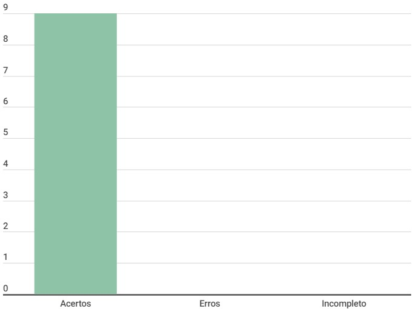

# Aspectos Éticos

## Introdução

Este documento é uma verificação do artefato [Aspectos Éticos](../../AnaliseDeRequisitos/aspectosEticos.md) na versão 1.1 de data 11/10/2023, autorado por [Limirio Guimarães](https://github.com/LimirioGuimaraes), que é integrante do [grupo 02](https://github.com/Mayara-tech), cujo projeto tem como foco o [Site Ventoy](https://www.ventoy.net/en/index.html), o propósito desta verificação é identificar possíveis problemas no artefato. 

## Metodologia 

A verificação do artefato seguirá o [planejamento](../../verificacao/planejamendoDaVerificacao.md) estabelecido pelo nosso grupo. Conforme detalhado no planejamento, destaca-se a relevância do subtópico da metodologia neste documento, para apresentar a tabela contendo os checklists utilizados para realizar essa verificação deste artefato em específico. Podemos observar o referido checklist referente a verificação do Cronograma na Tabela 1, as perguntas foram tiradas da verificação dos [aspectos éticos](../../verificacao/aspectos_eticos.md) feita pelo grupo.

**Tabela 1** - Checklist

| ID | Descrição                                                                           | Avaliação  | Observação |
|----|-------------------------------------------------------------------------------------|------------|------------|
| 1  | O histórico de versão é padronizado?                                                |      -     |     -      |
| 2  | Possui o(s) autor(es) e o(s) revisor(es) do artefato?                               |      -     |     -      |
| 3  | O artefato possui referências bibliográficas e/ou bibliografia?                     |      -     |     -      |
| 4  | Todas as tabelas e imagens são chamadas no texto, possuem legendas e fontes?        |      -     |     -      |
| 5  | Todos os textos estão na norma padrão?                                              |      -     |     -      |
| 6  | Há introdução do artefato?                                                          |      -     |     -      |
| 7  | O termo de consentimento garante o direito de aceitar ou recusar a participação?    |      -     |     -      |
| 8  | O documento garante o direito de confidenciabilidade dos dados pessoas do usuário?  |      -     |     -      |
| 9  | O documento garante o tratamento equitativo?                                        |      -     |     -      |
|10  | O documento garante a prevenção de dados?                                           |      -     |     -      |

Fonte: [Milena Baruc](https://github.com/MilenaBaruc)

## Desenvolvimento

Na tabela 2 podemos observar o checklist preenchido após verificação do artefato. Este checklist, minuciosamente preenchido, reflete os resultados, observações e considerações resultantes da análise realizada no artefato. A inspeção foi feita por meio de uma gravação individual, que está presentes na tabela 3.

**Tabela 2** - Checklist preenchido

| ID | Descrição                                                                           | Avaliação  | Observação |
|----|-------------------------------------------------------------------------------------|------------|------------|
| 1  | O histórico de versão é padronizado?                                                | Sim |     -      |
| 2  | Possui o(s) autor(es) e o(s) revisor(es) do artefato?                               | Sim |     -      |
| 3  | O artefato possui referências bibliográficas e/ou bibliografia?                     | Sim |     -      |
| 4  | Todas as tabelas e imagens são chamadas no texto, possuem legendas e fontes?        | Não se aplica |     -      |
| 5  | Todos os textos estão na norma padrão?                                              | Sim |     -      |
| 6  | Há introdução do artefato?                                                          | Sim |     -      |
| 7  | O termo de consentimento garante o direito de aceitar ou recusar a participação?    | Sim |     -      |
| 8  | O documento garante o direito de confidenciabilidade dos dados pessoas do usuário?  | Sim |     -      |
| 9  | O documento garante o tratamento equitativo?                                        | Sim |     -      |
|10  | O documento garante a prevenção de dados?                                           | Sim |     -      |

Fonte: [Milena Baruc](https://github.com/MilenaBaruc)

**Tabela 3** - Cronograma de verificação

| Participantes | Data | Horário | Link da gravação | Minutagem aonde começa |
| -------------------------------------------------------------------------------------------- | ---------- | ----- | ------------------- | ------------- |
| [Milena Baruc](https://github.com/MilenaBaruc)                                               | 02/12/2023 | 17:00/17:30 | [Verificação individual](https://youtu.be/hrXHrD7gICk)       | 00:08:00 |

Fonte: [Milena Baruc](https://github.com/MilenaBaruc) 

## Dados gráficos

Segue no gráfico 1, o gráfico onde podemos ver com maior facilidade os erros, acertos e incompletos do artefato.

**Gráfico 1** - Dados visuais

Fonte: [Milena Baruc](https://github.com/MilenaBaruc)

## Sugestões de Melhorias

O artefato, ao meu ver, está ótimo, e em conformidade com o que foi solicitado. 

## Referência Bibliografica

> 1. Ventoy. Interacao-Humano_computador. Distrito Federal, 2023. Disponível em: <https://interacao-humano-computador.github.io/2023.2-Ventoy/>. Acesso em: 02/12/2023.

## Bibliografia

> BARBOSA, S. D. J.; Silva, B. S. da; Silveira, M. S.; Gasparini, I.; Darin, T.; Barbosa, G. D. J. (2021);Interação Humano-Computador e Experiência do usuário.

## 📑 Histórico de Versões

| Versão | Data       | Descrição                                       | Autor                                          | Revisor                                      |
| ------ | ---------- | ----------------------------------------------- | -----------------------------------------------| ---------------------------------------------|
| `1.0`  | 02/12/2023 | Criação do Documento | [Milena Baruc](https://github.com/MilenaBaruc)  | [nome](https://github.com/)|