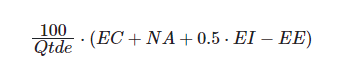

# Verificação Metodologia

 
## Introdução

Este documento é uma verificação do artefato [Metodologia](https://interacao-humano-computador.github.io/2023.2-Ventoy/planejamento/metodologia/) na versão 1.1 de data 28/11/2023, autorado por [Breno Queiroz](https://github.com/brenob6) e [Altino Arthur](https://github.com/arthurrochamoreira), que é integrante do [grupo 02](https://interacao-humano-computador.github.io/2023.2-Ventoy/), cujo projeto tem como foco o site do [Ventoy](https://www.ventoy.net/en/index.html), o propósito desta verificação é identificar possíveis problemas no artefato de metodologia.

## Metodologia 

A verificação do artefato seguirá o [planejamento](https://interacao-humano-computador.github.io/2023.2-Ventoy/verificacao/planejamendoDaVerificacao/) estabelecido pelo nosso grupo. Conforme detalhado no planejamento, destaca-se a relevância do subtópico da metodologia neste documento, para apresentar a tabela contendo os checklists utilizados para realizar essa verificação deste artefato em especifico, onde as perguntas de 1 a 5 são referentes ao checklist geral do projeto e as perguntas de 6 a 11 referentes a metodologia retiradas do livro Scrum Guide^1^. Podemos observar esse checklist na Tabela 1. 

**Tabela 1** - Checklist - Metodologia

| ID | Descrição                                                                                                                      | Avaliação  | Observação                                                             |
|----|--------------------------------------------------------------------------------------------------------------------------------|------------|------------------------------------------------------------------------|
| 1  | O artefato possui Introdução?                                                                                                  | -          | -                                                                      |
| 2  | O artefato possui bibliografia/referências bibliográficas?                                                                     | -          | -                                                                      |
| 3  | O artefato possui um histórico de versões com o id e descrição das versões, data, autores e revisores?                         | -          | -                                                                      |
| 4  | Todas as tabelas e imagens são chamadas no texto, possuem legendas e fontes?                                                   | -          | -                                                                      |
| 5  | Todos os textos estão na norma padrão?                                       						      | -          | -                                                                      |
| 6  | 	O artefato especifica claramente a escolha de métodos ágeis e a justificativa da sua escolha?						   				      | -          | -                                                                      |
| 7  | Os papéis principais (por exemplo, Scrum Master, Product Owner) estão definidos e alinhados com a abordagem ágil escolhida.       | -          | -                                                                      |
| 8  | A metodologia utilizado no projeto é descrita de forma detalhada, incluindo os passos a serem seguidos, as atividades a serem realizadas e os recursos necessários? | - |-                                            |
| 9  | A metodologia está fundamentada em teorias, conceitos ou abordagens reconhecidas na área?				      | -          | -  								    |
| 10  | O documento fornece informações suficientes para que a metodologia possa ser reproduzida pela equipe? 		      | -          | -  								    |
| 11  | E especificado como serão realizados as reuniões regulares (Sprints Planning, Daily Standup, Sprint Review)? 					        | -          | -  								    |

Fonte: [Mayara Alves](https://github.com/Mayara-tech)

 

## Desenvolvimento 

Na tabela 2 podemos observar o checklist preenchido após verificação do artefato. Este checklist, reflete os resultados, observações e considerações resultantes da análise realizada no artefato.

  
**Tabela 2** - Checklist preenchido - Metodologia 

| ID | Descrição                                                                                                                      | Avaliação  | Observação                                                             |
|----|--------------------------------------------------------------------------------------------------------------------------------|------------|------------------------------------------------------------------------|
| 1  | O artefato possui Introdução?                                                                                                  | Conforme          | -                                                                      |
| 2  | O artefato possui bibliografia/referências bibliográficas?                                                                     | Conforme          | -                                                                      |
| 3  | O artefato possui um histórico de versões com o id e descrição das versões, data, autores e revisores?                         | Conforme          | -                                                                      |
| 4  | Todas as tabelas e imagens são chamadas no texto, possuem legendas e fontes?                                                   | Não se aplica          | -                                                                      |
| 5  | Todos os textos estão na norma padrão?                                       						      | Conforme        | -                                                                      |
| 6  | 	O artefato especifica claramente a escolha de métodos ágeis e a justificativa da sua escolha?						   				      | Incompleto         | O artefato especifica os métodos ágeis que serão utilizados, entretanto não justificam o porque de suas escolhas                                                                    |
| 7  | Os papéis principais (por exemplo, Scrum Master, Product Owner) estão definidos e alinhados com a abordagem ágil escolhida.       | Não conforme   | O artefato não espefica quem serão os responsáveis por cada função do método ágil scrum.
| 8  | A metodologia utilizado no projeto é descrita de forma detalhada, incluindo os passos a serem seguidos, as atividades a serem realizadas e os recursos necessários? |  Incompleta | O artefato não descrever de forma detalhada como a equipe pretende utilizar os métodos escolhidos.                                            |
| 9  | A metodologia está fundamentada em teorias, conceitos ou abordagens reconhecidas na área?				      | Conforme         | -  								    |
| 10  | O documento fornece informações suficientes para que a metodologia possa ser reproduzida pela equipe? 		      | Incompleto          | O artefato não apresenta todas as informações necessárias para que a equipe utilize a metodologia. 								    |
| 11  | E especificado como serão realizados as reuniões regulares (Sprints Planning, Daily Standup, Sprint Review)? 					        | Conforme         | -  								    |

Fonte: [Mayara Alves](https://github.com/Mayara-tech)

## Sugestões de Melhorias

De maneira geral o artefato apresenta uma boa qualidade, uma boa formatação e uma boa padronização, além de ideias que foram documentadas de forma clara e concisa. Entretanto foram encontrados identificados alguns possíveis problemas em relação as especificações do check-list, sendo elas demonstradas na tabela 3. 

**Tabela 3** - Sugestões de melhoria - Metodologia

| ID | Descrição do problema | Sugestão de melhoria |
| --- | ---------------------| ---------------------- |
|  6   | O artefato especifica os métodos ágeis que serão utilizados, entretanto não justificam o porque de suas escolhas                   |   É sugerido que seja justificado a escolha da metodologia selecionada para o projeto e a importância de sua utilização para o desenvolvimento do projeto.                     | 
|  7   | O artefato não espefica quem serão os responsáveis por cada função do método ágil scrum.                   |   É sugerido que seja identificado a função de cada membro da equipe dentro do método scrum, para que fique claro a toda equipe seus respectivos papeis dentro da metodologia.                  | 
|  8   | O artefato não descrever de forma detalhada como a equipe pretende utilizar os métodos escolhidos.                     |   É sugerido que seja identificado a função de cada membro da equipe dentro do método scrum, para que fique claro a toda equipe seus respectivos papeis dentro da metodologia.                  | 
|  10   |O artefato não apresenta todas as informações necessárias para que a equipe utilize a metodologia.            |  Por causa da falta das informações especificadas nos itens mencionados anteriormente o artefato não possui as informações necessarias, desta maneira e sugerido ao grupo a correção dos itens mencionados anteriormente.                  | 

Fonte: [Mayara Alves](https://github.com/Mayara-tech) 

## Acompanhamento

A figura 1 apresenta um gráfico com o percentual de respostas sim, não, incompleto ou não se aplica, obtidas através da checklist de verificação.

**Figura 1** - Percentual das respostas obtidas na verificação 

Fonte: [Mayara Alves](https://github.com/Mayara-tech) 

### Percentual de aproveitamento 

Para saber a porcentagem de aproveitamento do artefato, será utilizado a Equação na figura 2:

**Figura 2** - Equação de percentual de aproveitamento

Fonte: [Mayara Alves](https://github.com/Mayara-tech)

Através dos checklists realizados podemos observar que:

- 6/11  exigências são atendidas (Conformes);
- 3/11 exigências estão incompletas;
- 1/11 exigências estão erradas ou não foram realizadas (Não conformes).
- 1/11 não se aplica.

Onde 11 é a quantidade de itens avaliados na verificação.

Portanto, com base no cálculo apresentado, pode-se dizer que o aproveitamento deste artefato está em 68,18%.

## Retrabalho

Como proposto por Fagan, para o retrabalho o autor do artefato [Breno Queiroz](https://github.com/brenob6) e [Altino Arthur](https://github.com/arthurrochamoreira) que irão fazer as correções dos problemas apresentados pela verificação. O responsável por essa verificação fará uma revisão das correções feitas, checando se as correções são suficientes e se foi introduzido novos erros ou não. A tabela 3 a seguir apresenta o cronograma de correções.

**Tabela 3** - Cronograma de Correções

| Data de Correção | Descrição                                    |                Responsável(eis)                |                 Revisor(es)                 |      Status      |
| :--------------: | :------------------------------------------- | :--------------------------------------------: | :-----------------------------------------: | :--------------: |
|  03/11/2023    | Justificação dos Métodos escolhidos | [Breno Queiroz](https://github.com/brenob6) | [Mayara Alves](https://github.com/Mayara-tech)|  |
|  03/11/2023    | Identificação de Responsabilidades no Scrum | [Breno Queiroz](https://github.com/brenob6) | [Mayara Alves](https://github.com/Mayara-tech)|  |
|  03/11/2023    | Detalhamento do Uso dos Métodos Escolhidos | [Breno Queiroz](https://github.com/brenob6) | [Mayara Alves](https://github.com/Mayara-tech)|  |

Fonte: [Mayara Alves](https://github.com/Mayara-tech)

## Referência bibliografica 

> THE SCRUM GUINE. Schwaber, K., & Sutherland, J. (2017). The Scrum Guide. Scrum.org. Disponível em: <https://scrumguides.org/> Acesso em: 01 de dezembro de 2023.
> 

## Bibliografia

> BARBOSA, S. D. J.; Silva, B. S. da; Silveira, M. S.; Gasparini, I.; Darin, T.; Barbosa, G. D. J. (2021);Interação Humano-Computador e Experiência do usuário.
> 
> BILHETERIA DIGITAL. Interacao-Humano_computador. Distrito Federal, 2023. Disponível em: <https://interacao-humano-computador.github.io/2023.1-BilheteriaDigital/>. Acesso em: 26/11/2023. 
>
> VICTOR, Lucas. [Planejamento de Verificação da Entrega 2](https://github.com/Requisitos-de-Software/2023.2-Economia-DF/blob/main/docs/verificacao/Grupo-02/Entrega-02/planejamento-verificacao-e2-grupo2.md), GAMA, FGA, 2023. Acesso em: 01 de dezembro de 2023.

## 📑 Histórico de Versões

| Versão |    Data    |       Descrição      | Autor                |   Revisor   |
| ------ | ---------- | -------------------- | ---------------------| ----------- |
| `1.0`  | 01/12/2023 | Adicionando verificação do artefato Metodologia   | [Mayara Alves](https://github.com/Mayara-tech) |  |

